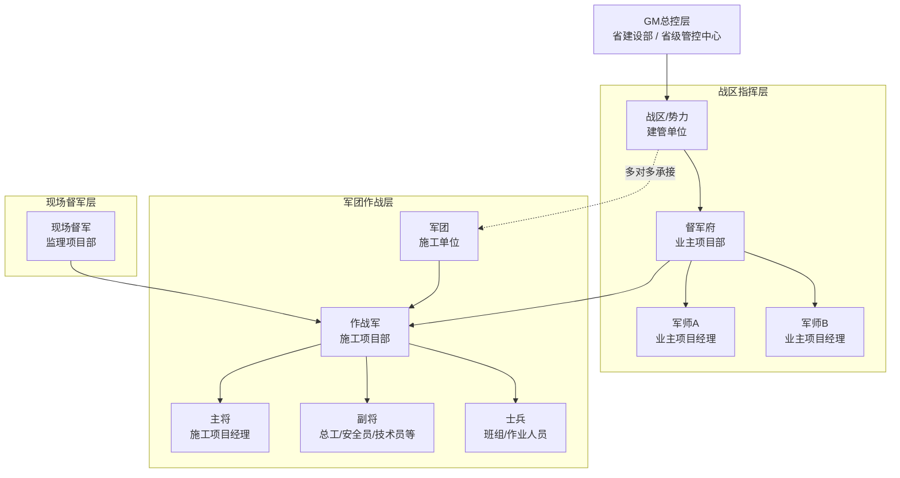

下面这版可直接粘贴回《基建online策划方案》。正文我按正式方案体例写，已把你确认过的角色纠偏、需求分析、机制设计、数据关系和分期落地统一进去。

------

# 《基建online：输变电工程调度指挥沙盘（严肃游戏化）策划方案》修订稿

**版本**：v1.1
**日期**：2026-04-14
**状态**：正式修订稿
**适用范围**：用于替换原《基建online策划方案》中“核心架构、角色系统、数据模型”相关内容，并新增“需求分析、机制设计”篇章。

------

## 一、项目定位与修订说明

### 1.1 项目定位

基建online不是传统娱乐游戏，而是面向输变电工程建设管理场景的**严肃游戏化调度指挥沙盘**。
其本质是：以真实业务规则、真实组织关系、真实过程数据为底座，以“赛季、战区、军令、战绩、履历”等游戏化表达增强理解、参与和调度效率，最终服务于工程建设全过程的统筹、预警、指挥、督办、评价与复盘。

### 1.2 本次修订目标

本次修订不是在MVP第二轮之上简单“加特效”，而是将数字沙盘从“态势展示工具”升级为“线上线下联动的调度指挥系统表达层”。
修订目标有四项：

1. 从“看得见”升级到“能指挥、能闭环、能结算”。
2. 从“项目展示”升级到“组织—项目—人员”三维联动。
3. 从“单位评价”升级到“单位绩效 + 个人战绩 + 历史履历”并行。
4. 从“单次看板”升级到“赛季化持续运营机制”。

### 1.3 修订原则

1. **业务真实性优先**：所有机制必须能映射到真实职责链、审批链、作业链。
2. **数据驱动优先**：所有状态、战绩、预警、履历都必须有数据来源或规则来源。
3. **工单闭环优先**：所有“军令”最终都要落到工单、事件或既有业务单据上。
4. **渐进落地优先**：P1先跑通机制，P2补足工程骨架，P3再做实时联动。
5. **表达增强而非娱乐化失真**：游戏化只用于增强理解与参与，不改变管理责任本质。

------

## 二、需求分析

### 2.1 当前基础与机会点

当前数字沙盘MVP第二轮已经具备以下基础：

- 当前作业点上图
- 按天时间轴与历史回溯
- 地图、筛选、统计、详情联动
- 风险等级与人数表达
- 大屏化桌面展示能力

这说明基础“态势表达层”已经成立，但当前仍主要停留在“看到发生了什么”，还没有形成“为什么发生、谁来处理、处理到哪一步、如何评价”的完整管理闭环。

因此，基建online的下一阶段价值，不在于继续堆叠静态图层，而在于建立一套以**事件、工单、角色、战绩、履历**为核心的调度指挥机制。

### 2.2 当前核心痛点

#### （1）看板有态势，缺少指挥链

现有系统能展示点位、风险和人数，但还不能表达：

- 谁对该项目负责
- 谁在指挥
- 谁在现场约束
- 谁在实际作战
- 遇到异常后如何被推动闭环

#### （2）评价有单位感，缺少个人感

当前看板更容易形成项目和单位层面的观察，但实际管理中既要评价建管单位，也要评价具体人员。尤其是业主项目经理、施工项目经理、关键岗位人员，其战绩与履历必须可追溯。

#### （3）展示有画面，缺少机制

如果没有赛季目标、事件触发、军令映射、结算规则、申诉复核、履历保留等机制，所谓“游戏化”就会沦为外观包装，而不是管理创新。

#### （4）组织关系复杂，现有表达过于单线

真实业务中存在以下复杂关系：

- 省建设部/省级管控中心负责赛季目标发布、规则制定和提级介入
- 建管单位与施工单位是多对多关系
- 督军府下有多个军师，一个军师对应一个业主项目经理个人席位
- 军团是施工单位，作战军是施工项目部
- 监理项目部不是旁观者，而是现场督军体系的重要组成
- 项目未完成人员调整必须进入履历，但要区分全程与中途参与

这决定了系统设计不能再采用单角色、单隶属、单结果的简单模型。

### 2.3 用户与管理对象

本系统面向四类核心用户：

| 用户层级   | 代表对象                             | 核心诉求                                   |
| ---------- | ------------------------------------ | ------------------------------------------ |
| GM总控层   | 省建设部、省级管控中心               | 发布赛季目标、设置规则、全省统筹、提级介入 |
| 战区指挥层 | 建管单位、督军府、军师               | 分解目标、统筹资源、指挥项目、承接评价     |
| 现场督军层 | 监理项目部                           | 现场巡视、旁站、转序、整改、复核、约束施工 |
| 军团作战层 | 施工单位、施工项目部、主将/副将/士兵 | 接单执行、资源组织、现场实施、结果交付     |

### 2.4 产品目标

基建online应实现以下五个产品目标：

1. **态势可视化**：看清当前区域、项目、作业与风险状态。
2. **指挥可执行**：每一条军令都能落到责任对象与处置动作。
3. **过程可闭环**：从事件触发到整改验收形成完整流程。
4. **评价可追责**：单位、项目、个人三类评价并存。
5. **履历可沉淀**：所有关键岗位任职、变更、战绩都可留痕沉淀。

------

## 三、核心架构（替换原 2.1）

### 3.1 总体架构

基建online采用“四层调度指挥架构”：

**GM总控层 — 战区指挥层 — 现场督军层 — 军团作战层**

这四层不是抽象的游戏设定，而是对真实基建组织与责任链的游戏化表达。

### 3.2 四层架构定义

#### 3.2.1 GM总控层

**业务对应**：省建设部 / 省级管控中心
**系统定位**：赛季发布者、规则制定者、全局裁判、提级干预者

**核心职责**：

- 发布赛季目标
- 配置预警规则、工单规则、结算规则
- 监控全省项目态势
- 对重大异常发起提级介入
- 负责争议裁决与赛季复盘

#### 3.2.2 战区指挥层

**业务对应**：建管单位 + 督军府 + 军师体系
**系统定位**：区域与项目指挥中枢

该层内部再拆为三层：

- **战区 / 势力** = 建管单位
- **督军府** = 业主项目部 / 建管侧项目指挥单元
- **军师** = 业主项目经理个人角色

**关键定义**：
一个督军府可以有多个军师；每个军师是一个独立的个人战绩与个人履历载体。
这意味着系统必须同时支持“组织协同”与“个人评价”两套逻辑。

#### 3.2.3 现场督军层

**业务对应**：监理项目部
**系统定位**：现场督军 / 监军系统

**核心职责**：

- 对现场作业进行巡视、旁站、转序验收
- 对问题发起整改、复核与过程约束
- 支撑业主项目部开展现场管理
- 在制度允许范围内发起停工类、整改类、复工验收类流程

**产品表达原则**：
监理不是“观察者”，而是“现场控制链的重要执行者”。

#### 3.2.4 军团作战层

**业务对应**：施工单位 + 施工项目部 + 作业队伍
**系统定位**：军团 / 作战军 / 主将副将 / 士兵

该层内部再拆为四层：

- **军团** = 施工单位
- **作战军** = 施工项目部
- **主将** = 施工项目经理
- **副将/士兵** = 项目关键岗位人员 / 班组作业人员

**关键定义**：
军团负责组建与任命，作战军负责实际作战。
军团与战区为多对多关系，不存在天然唯一归属。

### 3.3 架构图（Mermaid）

------

## 四、机制设计

## 4.1 总机制：事件驱动 + 工单闭环 + 战绩结算

基建online不以“点击交互”作为核心，而以“业务事件”作为核心。
系统最小业务颗粒统一定义为：

**事件（Event） + 工单（Work Order） + 结算（Settlement）**

三者关系如下：

- **事件**：表达异常、变化、触发信号
- **工单**：表达责任、动作、时限、证据、验收
- **结算**：表达奖惩、战绩、履历影响、申诉结果

### 4.1.1 事件定义

事件是系统对真实管理状态变化的表达，包括但不限于：

- 进度偏差
- 风险聚集
- 停工/复工
- 资源短缺
- 质量返工
- 旁站异常
- 转序未通过
- 工单超期
- 人员调整
- 关键节点达成

### 4.1.2 工单定义

工单是闭环责任载体，必须包含：

- 发起人
- 责任对象
- 截止时间
- 验收链
- 证据要求
- 是否影响战绩
- 是否允许申诉

### 4.1.3 结算定义

结算分为三类：

1. **过程结算**：对执行及时性、质量、安全、协同进行即时加减分
2. **阶段结算**：对开工、转序、投产等节点统一结算
3. **赛季结算**：对全年目标完成、组织绩效、个人战绩做最终归集

------

## 4.2 赛季机制

### 4.2.1 赛季定义

赛季周期默认按自然年运行。
每个赛季包含：

- 年度开工目标
- 年度投产目标
- 关键专项目标
- 战区目标分解
- 规则版本
- 结算版本

### 4.2.2 GM行为

GM具备以下赛季级动作：

- 发布赛季目标
- 发布重点战区与重点项目
- 配置预警规则
- 调整结算参数
- 发起全省专项活动
- 提级介入重大异常
- 赛季末发布复盘与榜单

### 4.2.3 战区承接

战区需将GM目标进一步拆解为：

- 战区级目标
- 督军府级目标
- 军师个人目标
- 项目目标
- 军团协同目标

------

## 4.3 军令机制

军令是前台表达，工单是后台落地。
所有军令必须映射为新建工单、关联工单或规则触发动作。

### 4.3.1 军令类型

| 军令类型 | 发起层级     | 后台映射     | 主要作用             |
| -------- | ------------ | ------------ | -------------------- |
| 督战令   | GM/军师      | 进度督办工单 | 要求按节点推进       |
| 支援令   | GM/战区/军师 | 资源协调工单 | 协调人机料法环支援   |
| 调整令   | 军师/督军府  | 变更申请工单 | 对非刚性计划做调整   |
| 请示令   | 军师/战区    | 提级审批工单 | 请求上级介入或裁决   |
| 整改令   | 监理/军师    | 问题整改工单 | 推动安全质量问题闭环 |
| 复工令   | 监理/军师    | 复工验收工单 | 验收通过后恢复作业   |

### 4.3.2 军令原则

- 不允许“空军令”
- 军令必须有责任对象
- 军令必须有时限
- 军令必须可追溯
- 军令影响战绩时必须可申诉

------

## 4.4 战绩机制

### 4.4.1 战绩分层

系统同时维护三套战绩账本：

#### （1）个人战绩

适用于：

- 军师
- 主将
- 副将
- 关键作业骨干

#### （2）单位战绩

适用于：

- 战区 / 建管单位
- 督军府 / 业主项目部
- 军团 / 施工单位
- 监理单位

#### （3）项目战果

适用于：

- 单个项目
- 单个关键阶段
- 单次重大事件

### 4.4.2 战绩构成

| 战绩来源   | 说明                         |
| ---------- | ---------------------------- |
| 目标达成分 | 开工、投产、关键节点达成     |
| 过程执行分 | 响应速度、闭环时效、配合质量 |
| 质量绩效分 | 一次通过率、返工率、验收表现 |
| 安全绩效分 | 零事故、违章、停工、风险失控 |
| 协同支援分 | 跨单位支援、资源协调成功     |
| 扣分项     | 违章、超期、失误、重复问题   |
| 荣誉项     | 示范、创优、优秀案例         |

### 4.4.3 结算原则

- **扣分实时生效**
- **加分延迟结算**
- **重大加分可冻结**
- **申诉期间进入冻结账本**
- **个人战绩是主账，单位战绩是汇总账**

------

## 4.5 履历机制（双轨履历）

履历机制是本次修订的关键内容之一。

### 4.5.1 履历目标

既要保留“人”的真实任职历史，也要区分“完整负责”与“阶段参与”的差异，避免只记结果、不记过程。

### 4.5.2 履历分类

#### （1）完整履历

指人员完整参与某项目全生命周期，或完整参与某一关键阶段。

示例：

- 从开工到投产全程担任军师
- 从施工进场到投产全程担任主将
- 完整负责某关键转序阶段

#### （2）非完整履历

指人员中途进入、中途退出、支援、替补、撤换、借调。

示例：

- 中途接任军师
- 中途更换主将
- 阶段性支援副将
- 项目未完工即调离

### 4.5.3 履历规则

- 战绩按实际在岗期间累计
- 完整履历享有完整任期权重
- 非完整履历必须记录进入时间、退出时间、原因、交接对象
- 履历永不丢失，但权重可区分

------

## 4.6 任命与调整机制

### 4.6.1 军师任职

军师是督军府中的个人席位。
一个项目可设置：

- 主军师
- 副军师
- 协同军师

### 4.6.2 军团与作战军关系

- 军团 = 施工单位
- 作战军 = 施工项目部
- 军团可派出多支作战军
- 一个战区可与多个军团协作
- 一个军团也可服务多个战区项目

### 4.6.3 任命与变更规则

- 作战军由军团发起组建
- 主将及关键岗位初始任命由军团提出
- 任命生效后，关键岗位调整须经建管侧同意
- 监理可提供现场履约风险意见
- 所有调整必须进入履历

------

## 4.7 健康度机制

项目健康度是“态势层”的核心状态值，不等于绩效分，也不等于结果分。
它用于表达项目当前运行状态。

### 4.7.1 健康度维度

建议至少由五个维度构成：

- 进度
- 安全
- 质量
- 资源
- 协同

### 4.7.2 健康度等级

- 绿色：运行正常
- 黄色：存在风险
- 红色：严重预警
- 灰色：停工/冻结

### 4.7.3 健康度与战绩关系

- 健康度是过程态
- 战绩是结果账
- 健康度变化可触发事件和工单
- 健康度本身不直接等同于战绩

------

## 4.8 申诉与复核机制

系统必须内置申诉机制，否则战绩无法用于严肃评价。

### 4.8.1 适用范围

适用于：

- 扣分争议
- 工单责任争议
- 验收结论争议
- 履历权重争议
- 关键岗位调整责任争议

### 4.8.2 流程

1. 发起申诉
2. 冻结争议分值
3. 监理/军师/督军府逐级复核
4. 必要时由GM裁决
5. 写回调整账本
6. 沉淀案例进入赛季复盘库

------

## 五、角色系统（替换原第三章）

## 5.1 术语表

| 游戏化术语  | 业务对应                    | 说明                       |
| ----------- | --------------------------- | -------------------------- |
| GM          | 省建设部 / 省级管控中心     | 赛季发布与提级干预         |
| 战区 / 势力 | 建管单位                    | 区域管理与目标归属         |
| 督军府      | 业主项目部                  | 建管侧项目指挥中枢         |
| 军师        | 业主项目经理                | 个人战绩与履历载体         |
| 现场督军    | 监理项目部                  | 现场巡视、旁站、验收、整改 |
| 军团        | 施工单位                    | 作战资源与任命来源         |
| 作战军      | 施工项目部                  | 项目级施工执行单元         |
| 主将        | 施工项目经理                | 作战军负责人               |
| 副将        | 总工/副经理/安全员/技术员等 | 项目关键岗位               |
| 士兵        | 班组/作业人员               | 实际作业执行者             |
| 军令        | 管理指令                    | 前台表达，后台落工单       |
| 战绩        | 绩效账本                    | 个人/单位/项目并行         |

## 5.2 角色职责定义

### 5.2.1 GM

- 发布赛季目标
- 发布规则与参数
- 监控全省态势
- 组织提级督办
- 裁决重大申诉

### 5.2.2 战区

- 承接赛季目标
- 管理战区资源
- 统筹多个项目
- 对督军府与军团协同结果负责

### 5.2.3 督军府

- 是项目指挥组织，不是单人
- 管理项目节奏、资源、协调与评价
- 统筹军师协同
- 对项目整体闭环负责

### 5.2.4 军师

- 是个人责任席位
- 负责项目策划、督办、协调、验收推动
- 可发起军令与申诉
- 战绩按人沉淀

### 5.2.5 现场督军

- 负责旁站、巡视、转序、整改与验收
- 为业主提供现场管控支撑
- 对作战军形成日常约束
- 是问题闭环的重要发起方

### 5.2.6 军团

- 负责组建作战军
- 负责任命主将与关键岗位
- 负责跨项目资源统筹
- 对项目执行能力承担供给责任

### 5.2.7 作战军

- 负责执行任务与上传证据
- 接受督军府指挥与现场督军约束
- 对安全、质量、进度、成本承担执行责任

------

## 六、机制映射表

## 6.1 军令—工单映射

| 前台军令 | 后台工单     | 默认发起者   | 默认承接者    |
| -------- | ------------ | ------------ | ------------- |
| 督战令   | 进度督办工单 | GM/军师      | 主将/作战军   |
| 支援令   | 资源协调工单 | GM/战区/军师 | 军团/协作单位 |
| 整改令   | 问题整改工单 | 监理/军师    | 作战军        |
| 复工令   | 复工验收工单 | 监理/军师    | 作战军        |
| 调整令   | 计划变更工单 | 军师         | 督军府/GM     |
| 请示令   | 提级审批工单 | 军师/战区    | GM            |

## 6.2 事件—状态映射

| 事件类型     | 触发结果                |
| ------------ | ----------------------- |
| 进度偏差     | 健康度下降 + 督战工单   |
| 质量返工     | 健康度下降 + 整改工单   |
| 停工类异常   | 灰色状态 + 冻结部分加分 |
| 关键节点达成 | 阶段加分进入冻结池      |
| 人员调整     | 履历写入 + 责任链刷新   |
| 工单超期     | 扣分 + 升级督办         |

------

## 七、数据模型（替换原 7.1）

## 7.1 设计原则

数据模型必须支持以下事实：

1. 建管单位与施工单位是多对多关系
2. 督军府可包含多个军师
3. 军团与作战军是两层关系
4. 个人履历必须可留痕
5. 战绩必须能区分个人、单位、项目
6. 项目未完工的人事调整必须可追溯

## 7.2 核心实体

### 7.2.1 Project

项目主表。

**关键字段**：

- `project_id`
- `project_name`
- `management_unit_id`
- `owner_command_post_id`
- `supervision_team_id`
- `project_type`
- `voltage_level`
- `status`
- `planned_start_date`
- `actual_start_date`
- `planned_completion_date`
- `actual_completion_date`
- `health_score`
- `health_level`

### 7.2.2 Owner_Command_Post

督军府主表。

**关键字段**：

- `owner_command_post_id`
- `management_unit_id`
- `name`
- `region_code`
- `leader_person_id`
- `status`

### 7.2.3 Advisor_Assignment

军师任职表。

**关键字段**：

- `advisor_assignment_id`
- `project_id`
- `owner_command_post_id`
- `advisor_person_id`
- `advisor_role_type`
- `start_time`
- `end_time`
- `participation_type`
- `entry_reason`
- `exit_reason`
- `is_full_cycle`

### 7.2.4 Contractor_Assignment

军团承接表，用于表达建管与施工的多对多关系。

**关键字段**：

- `contract_assignment_id`
- `project_id`
- `management_unit_id`
- `contractor_unit_id`
- `is_primary_legion`
- `start_time`
- `end_time`
- `contract_scope`

### 7.2.5 Battle_Unit

作战军表。

**关键字段**：

- `battle_unit_id`
- `project_id`
- `contractor_unit_id`
- `project_dept_id`
- `commander_person_id`
- `status`
- `appointed_by_contractor`
- `approved_by_management`
- `approve_record_id`

### 7.2.6 Career_Record

双轨履历表。

**关键字段**：

- `career_record_id`
- `person_id`
- `project_id`
- `org_type`
- `org_id`
- `role_name`
- `start_time`
- `end_time`
- `participation_type`
- `handover_to_person_id`
- `adjustment_reason`
- `full_cycle_weight`

### 7.2.7 Event

事件表。

**关键字段**：

- `event_id`
- `project_id`
- `object_type`
- `event_type`
- `severity`
- `rule_id`
- `triggered_at`
- `cleared_at`
- `linked_work_order_id`
- `current_state`

### 7.2.8 Work_Order

工单表。

**关键字段**：

- `work_order_id`
- `project_id`
- `source_event_id`
- `order_type`
- `priority`
- `creator_id`
- `assignee_type`
- `assignee_id`
- `sla_due_time`
- `acceptance_chain`
- `evidence_requirements`
- `status`
- `settlement_state`
- `points_delta`

### 7.2.9 Performance_Ledger

战绩账本表。

**关键字段**：

- `ledger_id`
- `owner_type`
- `owner_id`
- `season_year`
- `project_id`
- `source_type`
- `source_id`
- `points_before_freeze`
- `points_effective`
- `points_frozen`
- `points_adjusted`
- `reason_code`

------

## 八、界面与玩法表达原则

## 8.1 界面表达不是功能替代

地图、飞线、粒子、播报、榜单，都是表达层。
真正的内核是事件、工单、责任链、战绩、履历。

## 8.2 地图表达规则

P1阶段继续以当前已成熟的态势图为主，不强行引入大规模复杂三维。
地图上优先表达：

- 当前作业态势
- 事件热区
- 工单积压
- 战区归属
- 支援流向
- 项目健康度

## 8.3 动画触发规则

动画只由真实业务状态变化触发，包括：

- 新工单派发
- 支援令生效
- 事件升级
- 节点达成
- 赛季结算

------

## 九、分期实施建议

## 9.1 P1：机制打通版

目标：先把基建online从“展示系统”升级为“闭环系统”。

**交付内容**：

- 四层角色体系
- 事件中心
- 工单中心
- 基础军令系统
- 个人/单位/项目三类战绩账本
- 双轨履历
- 健康度P1模型
- 赛季目标面板
- 基础通知与结算播报

**明确不追求**：

- 大规模实时化
- 复杂三维骨架
- 全量飞线粒子
- 黑灯工地式智能联动

## 9.2 P2：工程骨架增强版

目标：把项目从“点位态势”升级到“工程骨架态势”。

**交付内容**：

- 变电站独立图层
- 线路与杆塔骨架图层
- 项目—工程对象绑定
- 分阶段节点展示
- 健康度P2模型
- 更多规则引擎与协同支援场景

## 9.3 P3：线上线下实时联动版

目标：真正形成调度指挥闭环。

**交付内容**：

- 实时推送
- 视频/感知联动
- 指挥会商模式
- 应急调度模式
- 施工承载力分析
- 智能预警和辅助决策

------

## 十、最终定义

基建online的最终产品定义，不是“把工程做成游戏”，而是：

**把真实工程管理组织、真实调度指挥链、真实数字工单闭环、真实绩效与履历沉淀，转译为一套更易理解、更易参与、更易统筹、更易复盘的严肃游戏化管理表达系统。**

它应同时满足三重目标：

1. 对上，服务GM总控与跨区域统筹；
2. 对中，服务战区、督军府与军师的项目指挥；
3. 对下，服务监理与军团作战层的过程执行和现场闭环。

------

## 十一、替换建议

建议你将原方案中的以下部分整体替换或重写：

- 原“2.1 双体系架构” → 替换为本稿“第三章 核心架构”
- 原“第三章 角色系统” → 替换为本稿“第五章 角色系统”
- 原“7.1 数据字段与关系模型” → 替换为本稿“第七章 数据模型”
- 在原方案前半部分新增“第二章 需求分析”
- 在核心玩法章节后新增“第四章 机制设计”

------

这版修订稿的依据有两类：一类是你当前MVP第二轮已明确的边界，例如按天回溯、当前以站班会点位为主、暂不做线路轨迹与实时刷新；另一类是你上传的公司制度与顶设文件，已经明确了数字工单、管控中心、省市分层、项目全过程调度指挥，以及“前期、业主、监理、施工”四大项目部的组织定位。

下一步最合适的是，我直接继续把这份修订稿扩成**完整可评审版**，把“原型页面清单、字段字典、事件枚举、工单状态机、战绩公式、P1开发范围”也一并写出来。