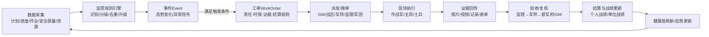

# 《基建online策划方案》修订稿深度研究与正式草案

## 摘要与关键结论

本修订稿将你现有《基建online策划方案 v1.0》中的三处核心段落（2.1 核心架构、第三章 角色系统、7.1 数据字段与关系模型）整体替换，并补齐“需求分析 + 机制设计”的正式策划文稿，形成一份可直接复制粘贴回原策划方案的**v1.1 修订稿**。修订重点围绕以下对齐目标落地：以“工单/事件”为最小业务颗粒、以“管控中心/GM”发布赛季目标与介入、以“GM总控层—战区指挥层（建管单位/督军府/军师）—现场督军（监理）—军团作战层（施工单位/作战军/主将等）”构建调度指挥链，并支持**建管单位与施工单位多对多**、**双轨履历（完整/非完整）**、**分期落地（P1/P2/P3）**。这些设计同时兼容你现有MVP第二轮“按天回溯、站班会点位上图、筛选统计详情联动、无线路轨迹/无实时推送/静态JSON数据”的技术与范围边界。fileciteturn0file1 fileciteturn0file2 fileciteturn0file0

在“研究与最佳实践”层面，本草案引用并吸收如下权威来源：  
项目治理/变更/角色责任采用我国现行国家标准 GB/T 37507-2025（等同采用 ISO 21502:2020）的项目管理概念与术语（如“变更申请”“治理”等），并以其“供应商-客户关系可能是多维的”表述支撑建管/施工多对多建模。citeturn2view1turn10view2turn10view0  
风险治理与监控规则引擎设计原则对齐“风险管理—指南”国家标准项目（修改采用 ISO 31000:2018）对风险管理价值与适用范围的阐述。citeturn9view0  
赛季复盘与持续改进对齐 GB/T 30339-2026《项目和项目群后评价指南》（及其标准文本对“持续改进、经验教训库、透明度与问责”的强调）。citeturn8view1turn8view0  
工单驱动、预警工单化、督办闭环等实践借鉴电力行业公开报道中“监测预警工单化”“督办工单”的典型做法（作为行业参考，而非强制标准）。citeturn3view0turn4search0  
“严肃游戏/游戏化”的概念边界引用学术界常用定义：严肃游戏强调在娱乐机制中嵌入教育/训练/组织目标，游戏化强调在非游戏情境使用游戏设计元素。citeturn7search1turn7search0

> 未提供项声明：你提到的“公司顶层设计（数字工单驱动、管控中心职能）”原文未提供，本文以**通用电力管控中心/工单驱动闭环**公开资料与国家标准方法论对齐；如需 100% 对齐公司口径，请在“待补齐清单”部分补充顶层设计原文或条款编号（见文末“未提供信息清单”）。

## 研究依据与现状约束

你的MVP第二轮系统能力边界是本修订稿分期落地（P1/P2/P3）的硬约束：当前系统以湖南省地图为中心，展示“站班会作业点位”，点大小由作业人数驱动、点颜色由风险等级驱动，并支持多维筛选、统计面板、详情面板与按天时间轴历史回溯；数据来自多日期静态JSON文件；明确未实现线路轨迹、杆塔图层、实时推送、后端服务与复杂动画。fileciteturn0file1 fileciteturn0file2


本草案因此采用“**先打通模型与闭环（工单/事件/履历/战绩），再补工程骨架（站址/线路/杆塔），最后做在线联动（实时/协同/应急）**”的路径，使P1即便在纯前端/弱后端条件下，也能跑通“事件→工单→处置→结算→战绩/履历”的闭环演示；P2/P3再逐步增强。fileciteturn0file2 fileciteturn0file1

## 《基建online策划方案》v1.1 修订稿正文

以下内容为**可直接复制粘贴**的修订稿正文（建议整体替换原策划方案对应章节；或作为 v1.1 新版本全文）。

### 文档头信息

《基建online：输变电工程调度指挥沙盘（严肃游戏化）策划方案》

版本：v1.1（修订稿）  
日期：2026-04-14  
状态：策划修订完成，等待顶层设计条款与数据样本校对（见“未提供信息清单”）  
修订范围：替换 2.1（核心架构）、第三章（角色系统）、7.1（数据字段与关系模型），并新增“需求分析与机制设计”完整章节。fileciteturn0file0

---

### 执行摘要

本方案将输变电工程数字沙盘从“态势展示大屏”升级为“**工单驱动的调度指挥沙盘**”，并通过严肃游戏化（Serious Game）机制增强参与感与穿透力：  
一方面，系统坚持“业务真实性与数据驱动”，所有可视化与玩法要素都由真实业务数据/真实流程触发；另一方面，通过赛季制、战绩、履历、军令表达等机制，把“发现问题—下发指令—现场处置—闭环验收—复盘改进”变成可执行、可追溯、可评价的指挥链。fileciteturn0file0 citeturn7search1turn7search0

本方案的最小业务颗粒采用“**事件（Event） + 工单（Work Order）**”：事件用于表达态势变化与异常信号，工单用于闭环落实责任、时限、证据与结算规则。此设计与风险管理“覆盖组织全生命周期、嵌入决策”的原则一致，也符合工程项目治理对“变更申请、治理主体、监督控制”的通用要求。citeturn9view0turn10view2turn8view0

---

### 产品定位与目标

产品定位：  
基建online 是面向输变电工程建设管理的“**调度指挥沙盘交互层**”，以数字工单闭环为内核，以地图沙盘/时间轴/事件流为表达载体，以赛季化与战绩化为组织激励机制，支撑 GM（省级总控）、战区（建管单位）、现场督军（监理）、军团（施工单位）多角色协同。fileciteturn0file0

核心目标（可验收）：

1) 提升态势洞察效率：同一视图下表达“区域热区、项目健康度、风险聚集、资源负荷、工单积压”。（P1先覆盖“作业点态势”，P2补工程骨架）fileciteturn0file2  
2) 提升调度穿透力：从“看见”升级到“能下令、能督办、能闭环”。（事件→工单→处置→验收→结算）citeturn4search0turn3view0  
3) 提升问责与评价精度：同时支持“单位战绩”和“个人战绩”，并以“双轨履历”区分全程贡献与中途参与。  
4) 提升管理参与感（严肃游戏化）：在不篡改业务事实的前提下，通过赛季/战绩/成就/播报增强组织动员与复盘驱动力。citeturn7search0turn7search1

---

### 需求分析与设计原则

需求范围假设（须与顶层设计对齐校验）：  
本方案默认公司管理机制强调“规则制定—监控预警—工单派发—督办核查—复盘改进”的闭环治理；公开行业案例亦存在“监测预警工单化、督办工单闭环”的做法可参考，但最终应以公司顶层设计为准。citeturn3view0turn4search0

设计原则（必须写入评审口径）：

- 真实性优先：所有数值、状态、动画必须可追溯至数据源与流程事件。fileciteturn0file0  
- 工单驱动：所有“军令”最终落为工单或引用既有工单，工单是责任与闭环载体。  
- 风险管理嵌入决策：监控规则引擎以风险管理原则为框架，覆盖计划、执行、监督、复盘。citeturn9view0  
- 变更治理：人员/计划/资源重大调整必须以“变更申请”形式可追溯，符合项目治理“指导与控制”的要求。citeturn10view2turn6search0  
- 分期落地：P1跑通闭环、P2补工程骨架、P3实现线上线下实时联动。fileciteturn0file2

---

### 核心架构（替换原 2.1）

本节将原“指挥体系/作战体系双体系架构”升级为“四层调度指挥循环”的正式架构：

**GM总控层 → 战区指挥层（建管单位/督军府/军师） → 现场督军层（监理） → 军团作战层（施工单位/作战军/主将等）**

该架构要点：

- GM总控层：发布赛季目标/规则/监控策略，并在重大异常场景提级介入。  
- 战区指挥层：以建管单位为战区（势力），设“督军府”作为项目指挥中枢；督军府内存在多个“军师”（业主项目经理个体），战绩以“人”为核心承载。  
- 现场督军层：监理项目部承担现场过程管控的关键角色（可触发停工类事件/工单，并支撑业主履责）。  
- 军团作战层：施工单位为“军团/雇佣兵集团”，可承接多个建管单位项目；施工项目部为军团派出的“作战军”，主将/副将/士兵构成军队编制；关键岗位任命由军团发起，任命后调整需经建管侧同意并留痕。此“供应商-客户角色可能多维”的视角与项目管理国家标准对供应商/客户关系的描述一致，可作为多对多建模的理论依据。citeturn10view0turn2view1

**角色关系示意图（Mermaid）**  
（用于说明组织层级与多对多关系，实际字段见“数据模型”）

```mermaid
flowchart TB
  %% Layers
  subgraph GM[GM总控层]
    GM1[省建设部/省级管控中心<br/>发布赛季目标·规则·监控策略<br/>提级介入/裁决]
  end

  subgraph Zone[战区指挥层]
    F[建管单位/战区(势力)]
    CP[督军府(业主项目部/指挥中枢)]
    A1[军师(业主项目经理#1)]
    A2[军师(业主项目经理#2)...]
    CP --> A1
    CP --> A2
    F --> CP
  end

  subgraph Field[现场督军层]
    SV[监理项目部(督军/监军系统)]
  end

  subgraph Legion[军团作战层]
    L[军团=施工单位(雇佣兵集团)]
    BU[作战军=施工项目部/军队]
    C[主将=施工项目经理]
    V[副将=总工/安全员/副经理等]
    S[士兵=班组/作业人员]
    L --> BU
    BU --> C
    BU --> V
    BU --> S
  end

  %% Many-to-many and project binding
  GM1 --> F
  F -- 多对多承接/框架合作 --> L
  CP -->|项目指挥/军令| BU
  SV -->|现场约束/停复工/验收| BU

  P[项目(Project)]:::core
  CP --> P
  SV --> P
  BU --> P

  classDef core fill:#f7f7f7,stroke:#666,stroke-width:1px;
```

（说明：Mermaid 图表达的“多对多承接、跨合同边界治理明确化”的理念可参考 GB/T 37507-2025 等同采用 ISO 21502:2020 对供应商/客户多维关系与跨边界治理澄清的要求。citeturn10view0turn2view1）

---

### 目标用户与角色体系（替换原 第三章）

**术语表（业务↔游戏化表达）**

| 术语 | 业务对应 | 游戏化表达 | 备注 |
|---|---|---|---|
| GM | 省建设部/省级管控中心 | GM/赛季发布者/裁判组 | 发布赛季目标与规则 |
| 战区/势力 | 建管单位 | 势力/战区 | 绩效按单位汇总 |
| 督军府 | 业主项目部/项目指挥中枢 | 督军府 | 多军师协同 |
| 军师 | 业主项目经理（个人） | 军师 | **战绩以人承载** |
| 现场督军 | 监理项目部 | 督军/监军系统 | 可触发停工类流程 |
| 军团 | 施工单位 | 军团/雇佣兵集团 | 与战区多对多 |
| 作战军 | 施工项目部 | 军队/作战分队 | 隶属军团，服务项目 |
| 主将 | 施工项目经理 | 主将/作战官 | 关键岗位变更需同意 |
| 副将 | 总工/安全员等 | 副将/将佐 | |
| 士兵 | 班组/作业人员 | 士兵 | 人员流动计入履历 |

**角色职责与权限（RACI式摘要，写入制度/权限设计输入）**

| 角色 | 主要职责 | 核心权限（系统内） | 关键约束 |
|---|---|---|---|
| GM | 发布赛季目标/规则；提级介入；裁决申诉 | 配置监控规则、结算规则、赛季目标；跨战区督办；冻结/裁决结算 | 重大事项以规则与裁决为主，避免替代战区日常指挥 |
| 战区（建管单位） | 区域统筹、资源协调、项目推进问责 | 战区维度排行、资源池视图、跨项目督办 | 与施工军团为多对多关系（非固定隶属）citeturn10view0 |
| 督军府 | 项目级指挥中枢，承载多个军师协同 | 对项目发起军令/工单；验收/复核入口 | 可经授权发起停复工建议 |
| 军师（个人） | 单项目推进与闭环责任；个人战绩承载 | 发起/接收工单；签署验收；发起申诉 | 人员调整、关键变更需留痕并影响履历 |
| 监理（现场督军） | 现场过程管控；旁站/验收；整改与停复工链条支撑 | 现场检查事件录入；整改工单触发；停工类建议/流程入口 | 监理支撑业主履责、结果由业主负总责（顶层设计未提供，需校对） |
| 军团（施工单位） | 组建作战军、任命将领、资源调配 | 任命作战军与主将；人员池管理；支援派遣 | 任命后关键岗位调整需建管侧同意并计入履历 |
| 作战军（施工项目部） | 具体施工执行、现场产出证据 | 执行工单；上传证据；日评价响应 | 受监理现场约束 |
| 主将/副将/士兵 | 任务执行与安全质量责任 | 与工单关联的执行/确认 | 关键岗位变更走审批 |

---

### 核心业务场景与主循环

**六大核心业务场景（需求分析口径）**

场景A：赛季开局与目标发布（GM主导）  
- GM发布年度/赛季目标（开工/投产/关键节点/安全质量KPI），同步发布监控规则与结算规则。  
- 战区/督军府进行目标分解与资源预布。  

场景B：日常值班调度（战区/督军府主导）  
- 每日进入“态势首页”：热点区域、风险聚集、活跃度、工单积压、超期督办。  
- 形成“今日作战清单”（工单池），支持一键派发/督办。  

场景C：异常预警处置（规则引擎触发）  
- 规则引擎生成异常事件（进度偏差/安全质量/资源冲突/反复停工等），自动分级、去重、升级。  
- 事件满足触发条件时自动生成工单，并进入督办链条。  

场景D：现场作业闭环（线上线下联动核心）  
- 作业计划/作业票 → 站班会/班前会确认 → 现场执行 → 监理日评价/旁站验收 → 证据归档 → 工单关闭。  
（P1可先以“站班会作业点位+日评价/整改工单”模拟闭环，P3再接入实时IoT/视频/定位）fileciteturn0file2  

场景E：里程碑结算（投产/开工/关键门禁）  
- 节点达成触发“阶段结算”：基础分入账；正向加分按规则“冻结/延迟发放”；负向扣分实时生效。  

场景F：赛季复盘（后评价与持续改进）  
- 按战区/督军府/军师/军团/作战军维度复盘：目标达成、规则有效性、异常类型、组织改进点。  
- 依据后评价指南“透明度、问责、持续跟踪、经验教训库”的原则输出赛季总结。citeturn8view0turn8view1

**主循环流程图（Mermaid）**



（注：主循环的“治理—监督—控制—变更—复盘”理念与项目管理国家标准对治理、控制、变更申请、持续改进等概念的要求一致。citeturn10view2turn2view1turn8view0）

---

### 关键业务对象定义（领域模型）

以下对象定义是后续数据库/接口/权限/结算的共同基准。

**对象：项目（Project）**  
定义：以输变电工程项目为主对象，承载目标、里程碑、健康度、事件与工单归集。项目管理与供应商边界、治理与责任链应清晰。citeturn2view1turn10view0  
关键字段（概念）：projectId、名称、类型（变电/线路）、电压等级、归属战区（建管单位）、计划开工/投产、实际开工/投产、状态、关键里程碑、健康度、当前热点指数。

**对象：督军府（Owner Command Post）**  
定义：战区内项目级指挥中枢（组织体），用于承载多军师协同、项目指挥链与审批链。

**对象：军师任职（AdvisorAssignment）**  
定义：军师（个人）在某项目的任职记录，是个人战绩/履历的核心锚点。支持“主军师/副军师/协同军师”。  
关键字段：projectId、advisorPersonId、角色类型、开始/结束时间、进入原因、退出原因、是否全程。

**对象：军团（Legion/ContractorUnit）与作战军（BattleUnit/ProjectDept）**  
定义：施工单位为军团（雇佣兵集团），与建管单位为多对多承接；作战军为施工项目部，是某项目实际执行单元。该“多维客户-供应商关系、跨边界治理需明确”可参考项目管理国家标准的供应商/客户章节。citeturn10view0turn2view1  
关键字段：军团ID、军团名称、资质、资源池；作战军ID、所属军团、项目ID、主将、编制规模、状态、任命/调整审批链。

**对象：事件（Event）**  
定义：对项目/作业/资源状态具有管理意义的状态变化或异常信号，用于态势表达与工单触发。事件必须可追溯（来源数据、规则ID、证据/日志）。  
字段：eventId、对象类型（项目/作业点/资源）、事件类型、严重度、生成时间、规则ID、关联工单、状态（新建/已确认/已解除/转工单）。

**对象：工单（WorkOrder）**  
定义：闭环执行的最小责任单元，包含责任人、时限、验收标准、证据要求、结算规则、申诉通道。公开行业案例中“派单-治理-督办-核查”“预警工单化”可作为闭环参考。citeturn4search0turn3view0  
字段：workOrderId、类型、来源事件、发起人、接单组织/个人、SLA时限、证据清单、验收人链、状态机、积分冻结/生效等。

**对象：履历（CareerRecord）**  
定义：记录人员（军师/主将/副将/士兵）在项目中的任职/参战历史，必须支持“双轨履历”以区分全程贡献与中途参与。  

- 完整履历：完整参与某项目全生命周期或完整阶段（如开工→投产，或某门禁阶段全程）。  
- 非完整履历：项目未结束发生调入/调出/替补/支援/撤换等，仍计入履历，但权重不同。

**对象：战绩（WarRecord / PerformanceLedger）**  
定义：战绩是对人而言的主账；单位战绩为汇总账。战绩来源于：里程碑基础分、过程分、事件分、荣誉分、扣分，以及冻结/申诉调整。  
该透明度与问责、持续跟踪与复盘改进的理念可参考后评价指南对“提升问责制和透明度、促进持续跟踪”的表述。citeturn8view0

---

### 工单与军令映射表

军令是“游戏化表达”，工单是“业务闭环载体”。所有军令必须落工单或绑定既有工单。

| 军令（前台表达） | 工单类型（后台） | 触发来源 | 责任链（默认） | SLA建议 | 结算规则摘要 |
|---|---|---|---|---|---|
| 督战令 | 进度督办工单 | 事件：偏差/停滞/超期 | 军师→作战军主将→监理复核 | 24-72h分级 | 达标按延迟加分；超期实时扣分 |
| 支援令 | 资源协调工单（人/机/料/法/环） | 事件：资源瓶颈/冲突 | 军师/战区→军团→作战军 | 24h响应/7d闭环 | 支援到位+协同分；虚报扣分 |
| 调整令 | 计划变更工单 / 变更申请 | 事件：不可抗/设计变更 | 军师→督军府→GM（重大） | 按门禁 | 变更获批不扣分；擅自变更扣分 |
| 请示令 | 提级协调/审批工单 | 事件：跨战区/重大风险 | 军师→战区→GM | 48h | 批准/驳回均留痕，不直接计分 |
| 停工令（现场） | 停工整改工单 | 监理检查事件 | 监理→军师确认→主将执行 | 立即生效 | 停工即时影响健康度；整改闭环再恢复 |
| 复工令 | 复工验收工单 | 整改完成事件 | 监理验收→军师确认 | 24h | 验收通过释放冻结加分 |

（注：“变更申请”作为提议项目变更的文件，是项目管理国家标准术语；本方案将“调整令/请示令”在后台统一映射为变更申请类工单，保证治理可追溯。citeturn10view2turn2view1）

---

### 健康度与结算算法（P1/P2）

#### 健康度（Health）算法

**P1版本（轻量：基于MVP现有字段与按天快照）**  
适用数据：站班会点位（经纬度）、作业人数、风险等级、作业状态、市州/建管单位、电压等级、日期快照。fileciteturn0file2

输出：HealthScore ∈ [0,100]，HealthLevel ∈ {绿/黄/红/灰停工}，并给出 Top3 原因标签。

建议公式（可解释、可落地）：

- ActivityScore：反映作业活跃度（人数与状态）
- RiskPenalty：反映风险压力（风险等级越高惩罚越大）
- VolatilityPenalty：反映波动与不稳定（按天人数变化/状态反复）
- OverduePenalty：反映工单超期（P1若无工单系统，可先用“连续N天预警未解除”模拟）

伪代码（示例）：

```text
# inputs (per project/day aggregated from records)
personCount = sum(currentConstrHeadcount)
riskMax = max(reAssessmentRiskLevel mapped 1-4, unknown->0)
workStatus = mode(currentConstructionStatus)  # working/paused/finished/unknown
delta = personCount - personCount_yesterday

statusWeight = {working:1.0, finished:0.8, paused:0.4, unknown:0.6}[workStatus]
activity = clamp( log(1+personCount) / log(1+300), 0, 1) * statusWeight

riskPenalty = {0:0.05, 1:0.10, 2:0.20, 3:0.35, 4:0.50}[riskMax]   # unknown small penalty
volatilityPenalty = clamp( abs(delta) / max(1, personCount_yesterday+50), 0, 0.30)

healthScore = 100 * ( 0.65*activity + 0.35*(1-riskPenalty) - volatilityPenalty )
healthScore = clamp(healthScore, 0, 100)

if workStatus == paused and personCount == 0: healthLevel = "停工/灰"
elif healthScore >= 80: healthLevel = "绿"
elif healthScore >= 60: healthLevel = "黄"
else: healthLevel = "红"
```

**P2版本（完整：引入项目主数据、里程碑、质量安全与挣值指标）**  
当项目具备“计划基线、里程碑门禁、成本/进度数据”后，建议引入挣值/门禁治理视角（我国已发布 GB/T 39888-2021 等同采用 ISO 21508:2018 的挣值管理标准，可作为方法学参考）。citeturn11search0turn11search3

建议权重（可配置）：  
Schedule（35%）+ Safety（25%）+ Quality（20%）+ Resource（10%）+ Collaboration（10%）

示例公式（概念）：

- ScheduleIndex：基于里程碑达成率、关键路径偏差、（可选）SPI  
- SafetyIndex：事故/违章/停工次数与严重度  
- QualityIndex：一次验收通过率、返工次数  
- ResourceIndex：人机料到位率、冲突次数  
- CollabIndex：工单响应时效、跨单位支援成功率

输出：HealthScore、HealthLevel、原因标签、建议动作（例如：发督战令/发支援令/提级请示）。

#### 结算（Settlement）算法

原则：**扣分实时生效；加分延迟结算；加分可冻结、可复核、可申诉。**（延迟加分可避免刷分；实时扣分强化底线约束。）fileciteturn0file0

结算账本分层：

- BasePoints：开工/投产/关键门禁达成  
- ProcessPoints：过程质量、安全、协同  
- EventPoints：预警、违章、返工、超期  
- HonorPoints：示范/创新/零事故等  
- FrozenPoints：待复核/待申诉  
- AdjustmentPoints：申诉裁决调整

示例规则：

- 负向事件（如严重违章/停工）立即扣分，且触发健康度降级  
- 正向事件先写入 FrozenPoints，待达到“门禁验收/投产结算/复核通过”后转正  
- 工单超期：按超期小时/天阶梯扣分，直到关闭  
- 结算以“人”为主账：军师/主将/副将按责任矩阵分摊；单位战绩为聚合

---

### 监控规则引擎需求与典型规则清单

#### 需求目标

监控规则引擎的目标是把“风险管理嵌入决策”，对项目/作业/资源状态变化进行识别、分级、去重、升级，并将有效信号转为事件与工单；风险管理作为通用方法可用于组织全生命周期、适用于各类风险与各层级决策。citeturn9view0

#### 引擎能力清单（P1→P3递进）

- 规则建模：规则ID、适用对象、阈值、严重度、触发/恢复条件  
- 事件去重：时间窗口、同源合并、抑制风暴  
- 升级策略：连续未解除自动升级（黄→红→提级）  
- 工单触发：按规则映射生成对应工单模板  
- 审计追溯：事件产生原因、输入数据快照、触发规则版本  
- 报表：规则命中率、误报率、闭环时效

#### 典型规则清单（建议起步 12 条）

进度类：  
1) 连续N天无有效进展（作业活跃度为0或极低）→ 生成“进度停滞事件”  
2) 关键里程碑超期X天 → “里程碑超期事件”→ 自动督战工单  
3) 频繁暂停/复工（N天内>=K次）→ “组织不稳定事件”

安全类：  
4) 高风险作业聚集（三级/四级风险点位超过阈值）→ “风险聚集事件”  
5) 停工事件触发后X小时未提交整改计划 → “停工超时事件”

质量类：  
6) 单位工程转序一次验收未通过 → “转序失败事件”  
7) 返工次数超过阈值 → “返工异常事件”

资源类（人机料法环）：  
8) 人员不足（计划人数vs实际人数差距）→ “人员短缺事件”  
9) 关键设备/物资未到货且已进入窗口期 → “物资瓶颈事件”  
10) 多项目争抢同一资源（同一军团/关键机械冲突）→ “资源冲突事件”

协同/工单类：  
11) 工单超期 → “工单超期事件”并滚动督办  
12) 连续扣分/重复同类问题 → “系统性问题事件”建议提级/复盘

---

### 资源调度（人机料法环）与支援类型

支援令（资源协调工单）必须覆盖“五要素”：

- 人（人员/班组/专家）  
- 机（机械/工器具/特种设备）  
- 料（材料/备品/到货）  
- 法（施工方案/工艺/许可）  
- 环（停电窗口/气象/交通/外部协调）

支援类型建议（用于地图飞线/动效/工单分类）：

| 支援类型 | 典型触发事件 | 工单证据要求 | 结算要点 |
|---|---|---|---|
| 人员支援 | 人员短缺/抢工期 | 到岗名单、资质、站班会记录 | 到位及时加分，虚报扣分 |
| 机械支援 | 关键机械冲突 | 调配单、到场照片、使用记录 | 资源利用率纳入评价 |
| 物资支援 | 物资瓶颈 | 到货单、签收、安装记录 | 超期影响进度健康度 |
| 专家支援 | 质量/技术瓶颈 | 评审纪要、方案版本、交底记录 | 方案变更需走变更申请citeturn10view2 |
| 外部窗口支援 | 停电/气象/外协调 | 批复文、窗口确认、通告 | 风险与不可抗因素留痕 |

---

### 可视化与动画触发原则

P1阶段遵循MVP边界：不引入大规模复杂特效，优先“所见即所得”。fileciteturn0file2

动画/可视化必须满足三条硬规则：

1) **业务触发**：动画只能由“事件/工单状态变化”触发（如下发、接单、超期、验收、结算）。  
2) **可关闭**：提供“动效开关/降噪模式”，避免大屏干扰。  
3) **可追溯**：动画对应的事件ID/工单ID可点击回溯。

建议动效映射：

- 军令连线：工单下发（军师→作战军）  
- 支援飞线：资源协调工单生效（来源战区/军团→目标项目）  
- 预警闪烁：事件未解除且达到严重度阈值  
- 庆祝粒子：投产结算完成且复核通过（避免“动画先于事实”）

---

### 数据模型与数据库字段清单（替换原 7.1）

说明：本节是“工单/事件/履历/战绩”与“组织关系（多对多）”落地的核心。P1可仅实现核心表的子集；P2/P3逐步补齐工程骨架与实时数据。

#### 项目主表 Project

| 字段 | 类型 | 必填 | 说明 |
|---|---:|---:|---|
| project_id | string | Y | 项目唯一标识 |
| project_name | string | Y | 项目名称（P1可用MVP字段 prjName 映射）fileciteturn0file2 |
| project_type | enum | Y | 变电/线路/综合 |
| voltage_level | string | N | 电压等级（P1沿用MVP电压口径）fileciteturn0file2 |
| management_unit_id | string | Y | 建管单位/战区ID |
| owner_command_post_id | string | Y | 督军府ID |
| supervision_team_id | string | N | 监理项目部ID |
| status | enum | Y | 前期/在建/停工/已投产/关闭 |
| planned_start_date | date | N | 计划开工 |
| actual_start_date | date | N | 实际开工 |
| planned_completion_date | date | N | 计划投产 |
| actual_completion_date | date | N | 实际投产 |
| health_score | number | Y | 0-100 |
| health_level | enum | Y | 绿/黄/红/灰 |
| season_year | int | Y | 赛季归属 |

#### 军师任职表 Advisor_Assignment

| 字段 | 类型 | 必填 | 说明 |
|---|---:|---:|---|
| advisor_assignment_id | string | Y | 唯一ID |
| project_id | string | Y | 项目ID |
| owner_command_post_id | string | Y | 督军府 |
| advisor_person_id | string | Y | 军师人员ID |
| advisor_role_type | enum | Y | 主军师/副军师/协同军师 |
| start_time | datetime | Y | 任职开始 |
| end_time | datetime | N | 任职结束 |
| participation_type | enum | Y | 全程/中途接任/中途调离/支援/替补/撤换 |
| entry_reason | string | N | 进入原因 |
| exit_reason | string | N | 退出原因 |
| is_full_cycle | bool | Y | 是否全程（用于双轨履历） |

#### 军团承接表 Contractor_Assignment（建管↔施工 多对多）

| 字段 | 类型 | 必填 | 说明 |
|---|---:|---:|---|
| contract_assignment_id | string | Y | 唯一ID |
| project_id | string | Y | 项目ID |
| management_unit_id | string | Y | 建管单位ID |
| contractor_unit_id | string | Y | 施工单位ID（军团） |
| is_primary_legion | bool | Y | 是否主力军团 |
| start_time | datetime | Y | 承接开始 |
| end_time | datetime | N | 承接结束 |
| contract_scope | string | N | 合同范围 |
| governance_notes | string | N | 跨边界治理约定（可选） |

（注：多对多建模与跨边界治理明确化的必要性，可参考国家标准对供应商-客户多维关系与合同双方应明确治理要素的要求。citeturn10view0turn2view1）

#### 作战军表 Battle_Unit（施工项目部）

| 字段 | 类型 | 必填 | 说明 |
|---|---:|---:|---|
| battle_unit_id | string | Y | 作战军ID |
| project_id | string | Y | 项目ID |
| contractor_unit_id | string | Y | 军团（施工单位） |
| project_dept_id | string | Y | 施工项目部ID |
| commander_person_id | string | Y | 主将ID |
| deputy_person_ids | array | N | 副将列表 |
| appointed_by_contractor | bool | Y | 军团任命标记 |
| approved_by_management | bool | Y | 建管同意标记 |
| approve_record_id | string | N | 审批记录 |
| status | enum | Y | 在战/调整中/撤编 |

#### 人员履历表 Career_Record（双轨履历）

| 字段 | 类型 | 必填 | 说明 |
|---|---:|---:|---|
| career_record_id | string | Y | 唯一ID |
| person_id | string | Y | 人员ID |
| project_id | string | Y | 项目ID |
| org_type | enum | Y | 建管/监理/施工 |
| org_id | string | Y | 组织ID |
| role_name | string | Y | 军师/主将/副将/士兵… |
| start_time | datetime | Y | 进入时间 |
| end_time | datetime | N | 退出时间 |
| participation_type | enum | Y | 全程/中途接任/中途调离/支援/替补/撤换 |
| handover_to_person_id | string | N | 交接人 |
| adjustment_reason | string | N | 调整原因 |
| full_cycle_weight | number | Y | 履历权重（全程>非全程） |

#### 工单表 Work_Order

| 字段 | 类型 | 必填 | 说明 |
|---|---:|---:|---|
| work_order_id | string | Y | 工单ID |
| project_id | string | Y | 项目 |
| source_event_id | string | N | 来源事件 |
| order_type | enum | Y | 进度督办/整改/停工/复工/资源协调/变更申请/提级请示… |
| priority | enum | Y | P0/P1/P2/P3 |
| severity | enum | Y | S1-S4 |
| creator_id | string | Y | 发起人（军师/监理/GM等） |
| assignee_type | enum | Y | 人/组织 |
| assignee_id | string | Y | 接单对象 |
| sla_due_time | datetime | Y | SLA截止 |
| acceptance_chain | array | Y | 验收链：监理→军师→督军府/GM |
| evidence_requirements | json | Y | 证据清单 |
| status | enum | Y | 草稿/已发/已接/处理中/待验收/已关闭/已驳回/申诉中 |
| settlement_state | enum | Y | 未结算/冻结/已生效/已调整 |
| points_delta | json | N | 结算分值（按角色分摊） |

#### 事件表 Event

| 字段 | 类型 | 必填 | 说明 |
|---|---:|---:|---|
| event_id | string | Y | 事件ID |
| project_id | string | Y | 项目 |
| object_type | enum | Y | 项目/作业点/资源/工单 |
| event_type | enum | Y | 进度偏差/风险聚集/停工/超期/返工… |
| severity | enum | Y | S1-S4 |
| rule_id | string | N | 触发规则 |
| triggered_at | datetime | Y | 触发时间 |
| cleared_at | datetime | N | 解除时间 |
| dedup_key | string | N | 去重键 |
| linked_work_order_id | string | N | 关联工单 |
| current_state | enum | Y | 新建/已确认/已解除/已转工单 |

---

### 分期实施计划与验收标准（P1/P2/P3）

分期原则：P1以“闭环与机制”优先，P2以“工程骨架”优先，P3以“实时联动与协同”优先；该策略与当前MVP第二轮“静态JSON、按天快照、无线路轨迹、无实时推送”的边界一致。fileciteturn0file1 fileciteturn0file2

| 阶段 | 目标 | 核心交付 | 验收标准（可判定） |
|---|---|---|---|
| P1 轻游戏化调度沙盘 | 跑通“事件→工单→闭环→战绩/履历” | 角色体系/权限雏形；工单中心（最小）；事件流；健康度P1；结算账本；双轨履历；基础动效（可关闭） | 1) 六大场景至少可演示3个端到端闭环；2) 任一工单可追溯到事件/发起人/验收链；3) 个人战绩与单位战绩可分开展示；4) 履历能区分全程/非全程并影响权重 |
| P2 工程骨架接入 | 形成“城池/道路/路标”工程表达 | 变电站站址图层；线路/杆塔骨架；项目与工程对象绑定；健康度P2（里程碑/门禁） | 1) 地图可切换“作业态势/工程骨架”；2) 项目可定位到站址/线路；3) 里程碑达成可触发阶段结算与播报 |
| P3 在线联动 | 实时态势与联合作战 | WebSocket实时推送；多端协同；视频/IoT/定位联动；应急调度；规则引擎增强 | 1) 关键事件到达端延迟可量化；2) 工单自动升级与跨层提级可用；3) 线上下发与线下回传证据闭环率可统计 |

---

### 风险与反游戏化约束

反游戏化约束（写入评审红线）：

1) 不创造虚构资源：所有分数、兵力、事件、健康度必须来自真实数据或可追溯规则。  
2) 不以娱乐方式公开敏感排行：个人战绩/单位考核按权限展示。  
3) 动画不先于事实：所有动效必须由事件/工单状态变化触发。  
4) 战绩不替代责任：战绩用于辅助评价，最终责任与管理制度一致。  

风险管理原则参考：风险管理有助于组织实现目标、嵌入决策制定并覆盖全生命周期。citeturn9view0

实施风险清单（建议）：

- 数据口径不一致（项目主数据/作业数据/合同数据）  
- 组织对“游戏化”误解导致阻力  
- 工单与既有系统重复建设（需顶层设计对齐：未提供）  
- 权限与责任链不清导致“背锅”争议（需治理与申诉机制）

---

### 变更与审批流程（人员任命/调整、工单申诉/复核）

#### 人员任命与调整流程（军团→建管同意→留痕履历）

规则摘要：  
- 作战军组建与主将任命：由军团发起；建管单位同意后生效。  
- 项目未结束的关键岗位调整：必须走审批并计入履历；全程履历与非全程履历区分对待。  

流程（文字版）：  
1) 军团提交任命/调整申请（包含理由、交接计划、风险评估、继任者）  
2) 监理给出现场履约意见（可选但建议）  
3) 军师/督军府审批（项目级）  
4) 战区审批（关键岗位/重大调整）  
5) GM提级审批（跨战区/重大风险）  
6) 生效后自动写入 Career_Record 与 Advisor_Assignment/Battle_Unit 变更记录  
7) 触发“履历类型”与“战绩权重”更新

（术语依据：变更申请是“提议项目做出变更的文件”，治理是“指导和控制组织的原则、政策和框架”。citeturn10view2）

#### 工单申诉与结算复核流程（冻结→复核→裁决→调整）

1) 发起申诉：个人/单位对扣分或结算提出申诉，生成“申诉工单/变更申请类工单”  
2) 自动冻结：相关积分进入 FrozenPoints，避免争议扩大  
3) 复核链：监理复核（现场证据）→军师/督军府复核（责任链）→GM裁决（必要时）  
4) 裁决出具：形成结论（维持/撤销/调整/重训/制度改进）  
5) 账本调整：AdjustmentPoints 写入战绩账本，并形成“经验教训”条目  
6) 复盘改进：纳入赛季复盘（后评价）与规则引擎优化

（后评价指南强调通过后评价提升透明度与问责、促进持续跟踪与经验教训利用，可作为“赛季复盘/申诉结论入库”的方法学依据。citeturn8view0turn8view1）

---

## 对齐与可落地性说明

本修订稿在不获取“公司顶层设计原文”的情况下，采用“国家标准方法学 + 行业公开案例 + 现有MVP边界”组合对齐：

- “治理/变更/角色责任/跨边界”采用 GB/T 37507-2025（ISO 21502:2020）与 GB/T 41245-2022（治理指南）的方法论作为策划的硬骨架。citeturn2view1turn10view2turn6search0  
- “风险与规则引擎”采用风险管理国家标准项目（ISO 31000:2018）对风险管理价值与适用范围的阐述作为原则层。citeturn9view0  
- “赛季复盘/经验教训”采用 GB/T 30339-2026 的后评价思想作为复盘机制依据。citeturn8view0turn8view1  
- “工单驱动闭环”用电力行业公开报道对“工单化预警/督办工单/闭环管控”的实践作为参考样式，而非强制规则；最终仍需顶层设计校对。citeturn3view0turn4search0  
- “严肃游戏/游戏化”用学术定义明确边界：在非娱乐目的下引入游戏机制服务训练/组织目标，避免“花哨大屏化”。citeturn7search1turn7search0  
- “分期计划”严格不突破MVP第二轮明确不做项（线路轨迹尚缺、无实时推送等），并将能力补齐放入P2/P3。fileciteturn0file2

## 未提供信息清单与需你确认的对齐项

以下信息若能补齐，将显著提升“公司口径一致性”与评审通过率：

公司顶层设计原文条款：数字工单定义、工单类型枚举、管控中心职能清单、组织问责口径（未提供）  
现有工单系统/平台接口：是否可引用既有工单、字段标准、权限体系（未提供）  
监理“停复工令”的制度依据与流程边界：监理发起/建议/执行/业主确认的准确链条（未提供）  
项目主数据与里程碑门禁库：开工/转序/投产的标准门禁字段（未提供）  
施工军团关键岗位变更审批层级：战区审批与GM提级审批的阈值规则（未提供）

（你如果把“顶层设计/工单字典/权责流程”任意一份文档上传，我可以把本修订稿中所有“假设项”替换成公司原文口径，并把工单类型、验收SLA、权重与审批链进一步固化为可执行版本。）