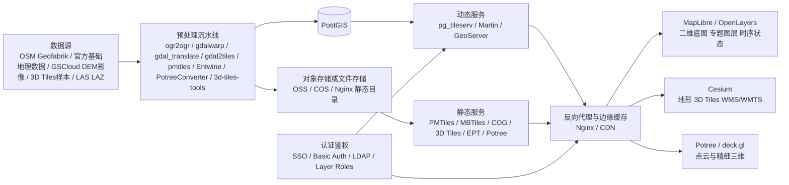

# 中国大陆可用的免费地图底图与空间数据源选型报告

## 执行摘要

面向中国大陆的输变电工程数字沙盘，如果目标是 **长期可控、可离线、可扩展、合规风险可管理**，最稳妥的路线不是把业务长期绑定在某一家在线底图 API 上，而是采用 **“自有数据主导 + 开源格式封装 + 必要时叠加国产在线底图”** 的组合：二维底图与专题图层以 **OSM/官方公共基础地理数据/公开 DEM** 为数据底座，落地为 **PMTiles / MBTiles / PostGIS / GeoServer / pg_tileserv**；三维场景以 **Cesium + 自托管 3D Tiles / 地形数据** 为主；点云与巡检精细场景以 **Potree 或 deck.gl** 补强。这样既能覆盖 Web 主平台，也能兼顾桌面离线包、内网部署和边缘节点分发。citeturn47search0turn46search0turn33search11turn44view0turn43search7turn27search3

从“在中国大陆合法可用且免费/开源”的角度看，可以分成三类：其一是 **可自建的数据**，如 OSM 原始数据、Geofabrik/BBBike 提取、OpenMapTiles/Protomaps/PMTiles 体系，以及中国官方公开基础地理数据；其二是 **可在线调用但条款严格的国产服务**，如天地图、高德、百度、腾讯位置服务；其三是 **公开遥感/地形/科研样本**，如 GSCloud 的 Landsat/SRTM/ASTER 数据、NASA 开放数据、JAXA AW3D30，以及国家地球系统科学数据中心中的 DEM、行政区划和部分 3D Tiles/OSGB 科研数据。第一类最适合生产级自托管，第二类更适合研发、演示、政务既有生态接入或短期补位，第三类适合影像、地形和三维样例补充。citeturn25search2turn15search0turn15search1turn15search10turn12search2turn14search0turn24search9turn25search0

本报告的核心结论是：**推荐优先方案** 为“**MapLibre/OpenLayers + 本地 PMTiles/pg_tileserv + PostGIS + GeoServer + Cesium 自托管 3D Tiles/DEM**”。若必须使用国产在线底图，优先使用 **天地图 WMTS/JS API** 或与客户现有资质匹配的厂商账号；而 **高德/百度/腾讯** 更适合作为在线 SDK 服务接入，不宜把其在线服务缓存为离线包或长期依赖为可再分发的底图资产。尤其要避免把 **WGS84/OSM/GPS 数据直接叠到高德/腾讯/百度底图** 上，因为腾讯明确使用 GCJ-02，百度使用 BD-09，未按官方方式转换会发生偏移。citeturn31search1turn9search1turn21view0turn18view5turn30view0turn40search1turn40search2

## 目标与判断标准

本次选型按输变电工程数字沙盘的典型需求来评价数据源与集成方案：一是 **中国大陆可达性与稳定性**，即是否能在中国大陆网络环境中稳定下载或调用；二是 **许可与合规**，即是否允许商业使用、是否允许缓存、是否能离线化、是否要求署名、是否受测绘或地图审核规则约束；三是 **工程适配性**，包括能否进入 **MapLibre / OpenLayers / Cesium / deck.gl / Potree / PostGIS / GeoServer** 体系，能否转换为 **PMTiles / MBTiles / COG / 3D Tiles / EPT / Potree** 等工程格式；四是 **运维成本**，包括是否能自托管、是否适合对象存储与 CDN、是否适合内网部署。相关判断同时参考了中国测绘法、测绘资质管理办法、标准地图公开使用要求，以及各平台的开发者条款。citeturn16search0turn17search1turn12search3turn44view0turn43search7turn27search3

需要特别强调三条工程红线。第一，**公共 OSMF 瓦片服务不是生产级托管服务**；OSMF 明确说明数据是开放的，但官方瓦片服务器不是，容量有限、无 SLA，重度使用可能被封禁，因此生产环境应使用替代服务或自托管。第二，**国产在线地图服务的免费层通常不等于“可离线重分发”**；高德明确禁止抓取、预读取、存储、缓存、镜像、下载其服务内容，高德 JS API 也明确不支持离线；百度要求仅能使用开放 API 所列数据展示，且面向公众免费网站免费，若商业应用直接或间接获益需要另行协议；腾讯虽提供 WebService 和 JS SDK，但其标准 WMTS 栅格瓦片服务在官方文档中属于高级付费服务。第三，**公开地图对外发布仍受审图和测绘管理约束**；自然资源部标准地图系统明确要求直接使用需标注审图号，编辑后的公开使用还需送审。citeturn46search0turn21view0turn22search0turn18view5turn30view0turn12search3turn16search2

## 数据源详述

### 开源底图与矢量数据

OpenStreetMap 是当前最成熟的开放底图数据底座之一。OSM 官方明确说明其数据以 **ODbL** 发布，允许复制、分发、改编，但要求署名并在对数据库进行修改或衍生时维持相同许可；因此，OSM 最适合作为**自建底图**、**专题图层底座**、**行政/道路/地名基础语义** 的来源，而不是直接长期依赖官方公共瓦片服务。Geofabrik 为中国范围提供 **`.osm.pbf` 与 `.gpkg.zip`** 提取，适合一次性拉取全国或省级数据；BBBike 则更适合按城市或自定义范围提取，并可导出 GeoJSON、Shapefile、SQLite、MBTiles 等多格式。citeturn47search0turn47search1turn11search0turn11search1

对于工程可视化，更推荐 OSM 的两条工程化路线。第一条是 **OpenMapTiles**：它提供开源的矢量瓦片 schema，官方文档明确 schema 以 BSD + CC-BY 形式开放，允许自生成和自托管；其 Quickstart 文档还给出 `./quickstart.sh china` 等区域构建方式，但也明确说明即便是小区域也需要约 15GB 级别磁盘，较大区域和全球构建会迅速走向数十 GB 到数百 GB 级需求。第二条是 **Protomaps/PMTiles**：Protomaps 提供单文件 PMTiles 下载与工具链，官方文档明确 PMTiles 是适合 HTTP Range 读取的单文件瓦片归档，既可以浏览器直读，也可以通过 `pmtiles serve` 暴露 ZXY 接口；其 Basemap 下载文档还给出了完整 planet 级 PMTiles 大约 120GB 的量级，适合“对象存储 + CDN + 浏览器直读”的低运维分发方式。citeturn32search1turn32search0turn33search11turn11search3turn44view0

就中国大陆访问体验而言，OSM 原始数据、Geofabrik、BBBike、OpenMapTiles、Protomaps 这类服务理论上都可用，但**下载链路通常依赖跨境网络**，官方也没有给出中国大陆可用性或 SLA 承诺；因此，适合的工程策略不是“在线依赖”，而是 **离线一次性拉取 + 本地转换 + 内部镜像/对象存储分发**。这一判断与 OSMF 官方“官方公共瓦片无 SLA、不能重度使用”的政策是一致的。citeturn46search0turn46search6turn11search0turn11search1

主要参考链接：OpenStreetMap 版权与许可、OSMF Tile Usage Policy、Geofabrik China Extract、BBBike Extracts、OpenMapTiles 文档、Protomaps PMTiles 文档。 citeturn47search0turn46search0turn11search0turn11search1turn32search1turn44view0

### 中国官方公共服务与国产在线底图

**天地图** 是最值得优先纳入“大陆可合法用的免费在线底图”清单的来源。其公开 API 脚本中可以直接看到 `t0` 到 `t7` 多子域、`vec/img/ter` 三类图层、`w/c` 两套坐标瓦片路径与 `tk=` 密钥参数，说明它本质上提供了可程序化调用的 WMTS 风格服务；同时，全国地理信息资源目录服务系统与其云中心相连，公开说明可免费下载 1:25 万、1:100 万公众版基础地理信息数据，并且数据下载入口已迁移到天地图平台。省级天地图服务条款也普遍要求遵守中国测绘法律、不得进行商业化宣传，并声明数据持续更新但不保证及时性，这意味着它更接近 **公共服务平台**，若作为政企生产底图长期使用，最好结合客户的正式接入、备案与授权流程。citeturn31search1turn24search1turn24search9turn25search0turn9search1turn9search4turn9search5

**高德** 更适合作为在线 LBS/动态地图 SDK，而不适合作为离线底图资产源。高德开放平台协议明确禁止抓取、预读取、存储、缓存、截图、镜像、下载服务内容，也禁止脱离服务单独使用或展示相关内容，并明确不允许为收费或获利目的对服务进行提供；其 FAQ/检索结果还明确写到 **JSAPI 地图接口和数据均不支持离线使用**。这意味着高德可以用于在线地图、路径、定位、动态叠加，但不适合做“缓存后转 MBTiles/PMTiles”“离线包内嵌高德底图”等做法。citeturn21view0turn22search0turn20view0

**百度地图** 的免费边界比高德表述得更直白：百度条款写明，百度地图 API 面向公众服务类网站是免费的，但前提是你的网站面向一般大众且免费；如果用于商业应用并直接或间接获益，则需要另行协议或书面许可。百度还明确要求只可使用开放 API 文档中列明的功能，不得直接存取其内部数据、图片、程序、模块等，同时要求保留版权与法律声明。其坐标说明页面还明确指出，百度服务使用 **BD-09**，若用 WGS84 或 GCJ-02 直接叠加会产生偏移。citeturn18view5turn40search2

**腾讯位置服务** 提供的免费能力主要在 JS API、WebService、SDK 和部分在线服务；但如果要用 **标准 WMTS 栅格瓦片服务**，官方 WMTS 文档明确写的是“高级付费服务，可申请试用”，并给出 `https://apis.map.qq.com/maptile/base/wmts?` 的 GetCapabilities 与 GetTile 请求规范。腾讯的使用条款还说明其可随时限制使用次数和数据量，并在坐标 FAQ 中明确其 API 使用的是 **GCJ-02**。因此，腾讯适合“在线接入、按 Key 调用、避免缓存”，并不适合作为免费可再分发瓦片源。citeturn30view0turn23search1turn40search1

主要参考链接：天地图 API 与服务条款、全国地理信息资源目录服务系统、天地图数据下载迁移说明、高德开放平台服务协议与 FAQ、百度地图使用条款与坐标说明、腾讯位置服务 WMTS 文档与使用条款。 citeturn31search1turn9search1turn24search1turn24search9turn25search0turn21view0turn22search0turn18view5turn40search2turn30view0turn23search1turn40search1

### 公开影像、DEM 与科研三维样本

在影像与 DEM 方面，**GSCloud 地理空间数据云** 是中国大陆非常有价值的官方/科研入口。GSCloud 官方介绍中明确提到平台汇聚了 Landsat 系列、中国及周边遥感数据、全球合成产品，以及 DEM 数字高程数据，包括 **30 米 GDEM** 与 **90 米 SRTM** 等；其使用说明要求标注来源和作者，并特别指出 **未经许可不得转让和传播从网站获取的数据**。这意味着 GSCloud 很适合做内部加工和项目分析底座，但如果要“打包再分发”，必须再核对 конкрет data set 的许可或取得授权。citeturn15search10turn25search2turn15search2

如果更看重国际开放性，**NASA Earthdata** 明确声明其地球科学数据与服务开放可用，NASA 数据“fully and without restrictions”；**JAXA AW3D30** 官方也明确说明该数据集 **no charge**，在 Terms for Use 下可使用。工程上，这两类数据非常适合做 **公开 DEM/地形底座**，在中国大陆通常建议先下载到本地，再重投影、压缩、切为 COG、栅格瓦片或 Cesium 地形格式，以避免跨境在线依赖。citeturn15search0turn15search8turn15search1turn15search5

在国产公开基础地理数据方面，**全国地理信息资源目录服务系统** 已经公开提供 1:25 万与 1:100 万公众版基础地理信息数据免费下载。1:100 万公众版数据覆盖全国并包含 **交通、管线、境界与政区、地貌与土质、植被、地名及注记** 等 9 大类；其中交通层直接包含国道、省道、县道、乡道、乡村道路，管线层包含输电线、通信线、油气水输送主管道以及变电站等要素，这与输变电工程数字沙盘天然相关。1:25 万公众版同样提供水系、公路、铁路、居民地、地名等 9 类要素。官方同时强调：这些是原始矢量而不是最终地图，若据此编制地图并向社会公开，仍需依法履行地图审核程序。citeturn25search0turn24search9

在“三维样本数据”方面，**国家地球系统科学数据中心** 已经出现直接提供 3D Tiles/OSGB 的科研数据集，例如“南师大仙林北区倾斜摄影实景三维模型 14 期数据”明确说明数据包含 **3DTile 和 OSGB** 倾斜三维模型，空间范围、时间范围和使用声明也写得很完整。与此同时，国家地球系统科学数据中心的总平台规则又强调平台内容受版权保护、未经书面许可不得复制修改传播销售。因此，对这类数据的正确使用姿势是：把它当作 **科研样本或内部验证样例**，逐数据集核验使用说明，而不是默认可用于商用公开发布。citeturn14search0turn15search3

主要参考链接：GSCloud 平台说明与数据使用声明、NASA Earthdata 开放数据政策、JAXA AW3D30 Terms、全国地理信息资源目录服务系统公开数据说明、国家地球系统科学数据中心数据条目与平台使用规则。 citeturn15search10turn15search2turn15search0turn15search1turn25search0turn24search9turn14search0turn15search3

### 离线单文件与开源切片源

从工程形态上看，**PMTiles 与 MBTiles** 是中国大陆项目很值得优先考虑的交付形态。PMTiles 官方 CLI 文档明确说明它是单二进制工具，可进行 `show / extract / merge / serve / convert` 等操作，支持把 **MBTiles 转为 PMTiles**，也支持直接把一个目录或对象存储暴露为 ZXY 接口，并建议生产环境放在 CDN 或反向代理后。对数字沙盘而言，这意味着可以把“省级线路/站点底图”“站区专题图”“单项目巡检底图”做成单文件归档，在笔记本、边缘服务器、内网对象存储上用极低运维成本分发。citeturn44view0

若需要标准 OGC 服务或兼容传统 GIS 客户端，可以选 **TileServer GL、GeoServer、Martin、pg_tileserv**。TileServer GL 明确可以把矢量瓦片与 GL 样式渲染成矢量或栅格地图，并兼容 MapLibre、Leaflet、OpenLayers 乃至 GIS via WMTS；Martin 明确支持从 **PostGIS 动态生成矢量瓦片**，也可以直接服务 **PMTiles 与 MBTiles**；pg_tileserv 则是更轻量的 PostGIS 专用方案，官方文档说明它会把符合条件的表和函数直接发布为瓦片图层，并带有 `/health` 端点；GeoServer 则天然适合 WMS/WMTS/矢量瓦片混合发布，并具备用户、角色、图层安全体系。citeturn43search1turn43search5turn32search3turn32search7turn43search7turn37search2turn27search3turn37search1turn38search0

主要参考链接：PMTiles CLI、TileServer GL、Martin、pg_tileserv、GeoServer Vector Tiles 与安全文档。 citeturn44view0turn43search1turn32search3turn43search7turn27search3turn37search1turn38search0

### 数据源对比表

| 数据源类别 | 典型来源 | 中国大陆可达性 | 许可/限制 | 更新与覆盖 | 是否适合离线化 | 适合与不适合 |
|---|---|---|---|---|---|---|
| 开源原始矢量 | OSM + Geofabrik/BBBike | 可用，但下载链路多依赖跨境网络；生产宜镜像/自托管 | OSM 数据为 ODbL，要求署名；Geofabrik/BBBike 主要提供提取服务。citeturn47search0turn11search0turn11search1 | Geofabrik 中国提取按省提供 `.pbf/.gpkg`；BBBike 支持自定义范围。citeturn11search0turn11search1 | 非常适合，可转 PostGIS、MBTiles、PMTiles、GeoJSON。citeturn44view0turn26search0 | 适合自建底图、道路/行政/地名；不适合直接把 OSMF 公共瓦片当生产底图。citeturn46search0 |
| 开源矢量瓦片产物 | OpenMapTiles / Protomaps | 可自建，成品下载通常跨境 | OpenMapTiles schema 开放，但仍需遵守 OSM 署名；Protomaps Basemap 需 OSM attribution。citeturn32search1turn11search3 | OpenMapTiles 可自行更新；Protomaps planet 约 120GB。citeturn32search0turn11search3 | 非常适合，尤其 PMTiles。citeturn44view0 | 适合省级/全国底图、离线包；不适合零运维又强依赖在线更新的团队。 |
| 官方公共基础地理数据 | 全国地理信息资源目录服务系统 / 天地图云中心 | 大陆访问友好 | 可免费下载，但公开编制地图仍须遵守地图管理与审核要求。citeturn25search0turn24search9turn16search2 | 1:100 万全国，1:25 万全国分幅，含交通/政区/地名/管线等。citeturn25search0turn24search9 | 适合，常见格式为矢量分幅，可入 PostGIS 或 GeoServer。 | 适合权威基础图层；不适合期望“互联网级细粒度 POI/道路时效”的前台产品。 |
| 官方在线底图 | 天地图 WMTS/JS API | 大陆访问友好 | 需 Key；省级条款普遍要求遵守测绘法律、不得商业化宣传，边界以官方接入条款为准。citeturn31search1turn9search1turn9search5 | 提供影像/矢量/地形与注记。citeturn31search1 | 可做在线调用；不建议未经许可重打包。 | 适合政企项目在线底图；不适合作为任意再分发离线资产。 |
| 国产商业地图免费层 | 高德 / 百度 / 腾讯 | 大陆访问最好 | 高德禁止抓取、缓存、镜像、下载，JSAPI 不支持离线；百度免费限面向公众且免费的网站，商用需协议；腾讯 WMTS 为高级付费服务。citeturn21view0turn22search0turn18view5turn30view0 | 数据较新，POI 与道路语义丰富。 | 一般不适合离线化与再分发。 | 适合在线 SDK、路径/搜索/定位；不适合做项目内永久底图资产。 |
| 公开遥感影像与 DEM | GSCloud / NASA / JAXA AW3D30 | GSCloud 大陆友好；NASA/JAXA 建议先下载本地 | GSCloud 要求注明来源且不得未经许可转让传播；NASA Earthdata 开放；AW3D30 no charge under terms。citeturn15search2turn15search0turn15search1 | GSCloud 提供 Landsat、30m GDEM、90m SRTM；AW3D30 30m 级。citeturn15search10turn25search2turn15search5 | 非常适合转 COG、瓦片、Terrain。citeturn27search0turn27search1 | 适合地形、影像分析与背景层；不适合要求现势性极高的商业卫星大图。 |
| 科研三维样本 | 国家地球系统科学数据中心部分 3D Tiles/OSGB 数据集 | 大陆访问友好 | 需逐数据集核验；平台层面版权与再传播限制较严。citeturn14search0turn15search3 | 可获得倾斜摄影、OSGB、3D Tiles 等样本。citeturn14search0 | 适合样例验证和内部研究。 | 适合原型与算法验证；不适合默认作商用公开底图。 |

## 方案比较与推荐

### 方案优劣与成本表

| 方案 | 典型技术组合 | 性能与可维护性 | 成本与运维 | 合规风险 | 适配建议 |
|---|---|---|---|---|---|
| 开源自托管矢量底图 | OSM/Geofabrik + OpenMapTiles/Protomaps + PMTiles + MapLibre/OpenLayers | 读取快、前端简单、适合 CDN，PMTiles 单文件利于发布；维护主要在数据更新链路。citeturn32search1turn44view0turn29search2 | 存储低到中；全国级 PMTiles 通常几十到百余 GB；运维低到中。citeturn11search3turn44view0 | 低，只要履行 OSM attribution 与数据来源合规。citeturn47search0 | **首选二维方案**。适合输电线路、站点、行政区、风险专题。 |
| 开源底图 + PostGIS 动态切片 | PostGIS + pg_tileserv/Martin + MapLibre/OpenLayers | 适合高频专题更新、属性过滤、权限控制；数据库压力高于静态 PMTiles。citeturn43search7turn32search3turn27search2 | 运维中等，需要数据库、备份、监控。 | 低到中，风险主要在业务数据本身。 | **首选专题图层方案**。适合停电范围、工单、设备状态动画。 |
| 国产在线底图接入 | 天地图 或 高德/百度/腾讯 SDK/API | 接入快；地图现势性好；但对缓存、离线与二次分发限制多。citeturn31search1turn21view0turn18view5turn30view0 | 初期成本低，长期受配额、条款、账号治理影响。 | 中到高，尤其离线化和商用边界。 | 适合研发演示、已有采购资质项目、短期上线。**不建议作为唯一底图策略**。 |
| 官方公开基础数据自建 | 全国地理信息资源目录系统 + GeoServer/GeoWebCache + Cesium/OpenLayers | 权威、内网友好；细节不如互联网底图，但管线/政区/交通等工程语义强。citeturn25search0turn24search9turn27search3 | 存储中等；切片一次性成本可控；运维中等。 | 低到中，主要在公开发布环节的地图审核。citeturn16search2 | 适合政企内网、权威展示、正式汇报。 |
| 影像地形与三维混合 | GSCloud/NASA/JAXA + COG/Terrain + Cesium + 自托管 3D Tiles + Potree | 三维效果最佳；数据准备最复杂；前端需要 2D/3D 协同。citeturn15search10turn15search0turn15search1turn26search2turn45search1 | 存储中到高，3D Tiles/点云可到 TB 级；运维高。 | 中，来源授权与公开发布边界要逐项核验。 | **首选三维沙盘方案**。适合站区、通道、无人机巡检、倾斜摄影。 |

综合推荐如下。若你要做的是 **长期生产型输变电数字沙盘**，建议把整体架构定为“**自托管为主，在线底图为辅**”：二维使用 **MapLibre 或 OpenLayers + PMTiles/pg_tileserv**；三维使用 **Cesium + 自托管 3D Tiles / TerraIn / WMS**；对于专项点云场景再引入 **Potree 或 deck.gl**。如果必须使用国产在线底图，**天地图优先于高德/百度/腾讯**，原因不是它一定“最好用”，而是它在中国大陆的政务/公共服务语境下更容易解释、接入和审计，而后三者更偏商业云服务和在线 API。citeturn31search1turn9search1turn44view0turn43search7turn27search3turn26search2turn45search1

### 推荐架构图



这种架构的优点是：底图和专题图层可彻底分层，底图优先用静态文件形式降低数据库压力，业务数据则走 PostGIS 和动态切片；认证鉴权既可放在 GeoServer/服务端，也可放在反向代理层；站区级三维、巡检点云、倾斜摄影与二维运行图可并行演进，而不会绑死在某一家在线底图厂商上。GeoServer 官方支持认证提供器与图层安全；pg_tileserv 提供轻量健康检查与预览；PMTiles 官方则建议生产环境放在 CDN 或反向代理之后。citeturn37search1turn38search0turn38search1turn37search2turn44view0

## 最小可运行示例与集成步骤

下面的示例都遵循“**先能跑、再替换真实数据**”的原则。为了便于复现，示例统一假设目标平台是 Web，本地启动可以使用 `python -m http.server`、`npx vite` 或任意静态文件服务器；生产环境则建议放到 Nginx、对象存储静态站点或容器中。

### 开源 PMTiles 底图与 MapLibre 集成

这个示例最适合做“开源底图 + 国内部署 + 离线包”的起点。官方文档表明，MapLibre 可以通过 `pmtiles` 插件直接读取 PMTiles，PMTiles CLI 可以把 MBTiles 转成 PMTiles，也可以直接在本地用 `pmtiles serve` 暴露 ZXY 接口。citeturn29search2turn29search6turn44view0

**依赖**

```bash
npm i maplibre-gl pmtiles
```

**数据准备**

如果你手头已有 `.mbtiles`，直接转成 `.pmtiles`：

```bash
pmtiles convert INPUT.mbtiles OUTPUT.pmtiles
```

如果只是做快速验证，也可以先用已有小样本或从外部样本档案裁切出一个很小的 PMTiles；`pmtiles extract` 支持按 bbox 或 GeoJSON polygon 提取子区域。citeturn44view0

**本地发布**

```bash
pmtiles serve . --port=8080 --public-url=http://localhost:8080 --cors=*
```

**关键代码**

```html
<!doctype html>
<html lang="zh-CN">
<head>
  <meta charset="utf-8" />
  <title>MapLibre + PMTiles</title>
  <link href="https://unpkg.com/maplibre-gl@latest/dist/maplibre-gl.css" rel="stylesheet" />
  <style>html,body,#map{margin:0;height:100%;}</style>
</head>
<body>
<div id="map"></div>
<script type="module">
  import maplibregl from "https://unpkg.com/maplibre-gl@latest/dist/maplibre-gl.js";
  import { Protocol } from "https://unpkg.com/pmtiles@latest/dist/pmtiles.js";

  const protocol = new Protocol();
  maplibregl.addProtocol("pmtiles", protocol.tile);

  const map = new maplibregl.Map({
    container: "map",
    style: {
      version: 8,
      sources: {
        base: {
          type: "vector",
          url: "pmtiles://http://localhost:8080/OUTPUT.pmtiles",
          attribution: "© OpenStreetMap contributors"
        }
      },
      layers: [
        { id: "water", type: "fill", source: "base", "source-layer": "water", paint: { "fill-color": "#a6cee3" } },
        { id: "roads", type: "line", source: "base", "source-layer": "transportation", paint: { "line-color": "#666", "line-width": 1.2 } }
      ]
    },
    center: [116.4, 39.9],
    zoom: 8
  });
</script>
</body>
</html>
```

**生产建议**

将 `OUTPUT.pmtiles` 放到 **OSS/COS/Nginx 静态目录**，浏览器直接用 Range 请求读取；若客户端类型很多、或需要兼容不能直接读 PMTiles 的引擎，再用 `pmtiles serve` 暴露标准 ZXY。官方文档建议生产环境放在 CDN 或反向代理之后。citeturn44view0turn33search4

主要参考链接：MapLibre PMTiles 示例、PMTiles CLI、PMTiles for MapLibre。 citeturn29search2turn44view0turn28search3

### 天地图 WMTS 与 OpenLayers 集成

这个示例适合中国大陆研发、政企项目对接或需要快速接入权威在线底图的场景。天地图 API 脚本中可以看到 `vec_w / cva_w / img_w / cia_w / ter_w / cta_w` 等 WMTS 模板，并通过 `tk=KEY` 鉴权。citeturn31search1

**依赖**

```bash
npm i ol
```

**关键代码**

```javascript
import Map from 'ol/Map.js';
import View from 'ol/View.js';
import WMTS from 'ol/source/WMTS.js';
import TileLayer from 'ol/layer/Tile.js';
import WMTSTileGrid from 'ol/tilegrid/WMTS.js';
import {get as getProjection} from 'ol/proj.js';
import {getWidth, getTopLeft} from 'ol/extent.js';

const projection = getProjection('EPSG:3857');
const projectionExtent = projection.getExtent();
const size = getWidth(projectionExtent) / 256;
const resolutions = Array.from({length: 19}, (_, z) => size / Math.pow(2, z));
const matrixIds = Array.from({length: 19}, (_, z) => z.toString());

const tk = '你的天地图Key';

const vec = new TileLayer({
  source: new WMTS({
    url: `https://t0.tianditu.gov.cn/vec_w/wmts?tk=${tk}`,
    layer: 'vec',
    matrixSet: 'w',
    format: 'tiles',
    projection: projection,
    tileGrid: new WMTSTileGrid({
      origin: getTopLeft(projectionExtent),
      resolutions,
      matrixIds
    }),
    style: 'default'
  })
});

const cva = new TileLayer({
  source: new WMTS({
    url: `https://t0.tianditu.gov.cn/cva_w/wmts?tk=${tk}`,
    layer: 'cva',
    matrixSet: 'w',
    format: 'tiles',
    projection: projection,
    tileGrid: new WMTSTileGrid({
      origin: getTopLeft(projectionExtent),
      resolutions,
      matrixIds
    }),
    style: 'default'
  })
});

new Map({
  target: 'map',
  layers: [vec, cva],
  view: new View({
    center: [12958000, 4853000],
    zoom: 10,
    projection
  })
});
```

**注意事项**

天地图适合在线调用，但条款体系更像公共服务平台而非可任意重分发的数据供应商。若你使用的是 `vec_w`、`img_w` 等在线服务，不建议自行离线抓取为 MBTiles/PMTiles；如果需要离线能力，建议改用官方公开下载数据、自建切片或签约获取允许范围。citeturn9search1turn9search5turn24search9turn25search0

主要参考链接：天地图 API、天地图省级服务条款、全国地理信息资源目录服务系统。 citeturn31search1turn9search1turn9search5turn24search9turn25search0

### PostGIS 与 pg_tileserv 动态专题图层

这个示例最适合做“线路、杆塔、站点、风险区、停电范围、工单状态”这类经常更新、需要属性过滤和权限控制的专题图层。pg_tileserv 官方文档说明它是 PostGIS-only tile server，会自动发布有空间列的表与符合签名的函数图层；PostGIS 则通过 `ST_AsMVTGeom` / `ST_AsMVT` 提供原生矢量切片能力。citeturn43search7turn27search2turn38search2

**数据准备**

```bash
# 例：把一个小范围 GeoJSON 导入 PostGIS
ogr2ogr -f PostgreSQL \
  PG:"host=127.0.0.1 port=5432 dbname=gis user=postgres password=postgres" \
  ./data/lines.geojson \
  -nln power_lines \
  -nlt PROMOTE_TO_MULTI \
  -t_srs EPSG:3857
```

**可选 SQL 视图**

```sql
CREATE OR REPLACE VIEW public.power_lines_pub AS
SELECT
  id,
  voltage,
  status,
  ST_Transform(geom, 3857) AS geom
FROM public.power_lines;
```

**前端接入 MapLibre**

```javascript
const map = new maplibregl.Map({
  container: 'map',
  style: {
    version: 8,
    sources: {
      lines: {
        type: 'vector',
        tiles: ['http://localhost:7800/public.power_lines_pub/{z}/{x}/{y}.pbf'],
        minzoom: 0,
        maxzoom: 14
      }
    },
    layers: [
      {
        id: 'lines',
        type: 'line',
        source: 'lines',
        'source-layer': 'power_lines_pub',
        paint: {
          'line-width': 2,
          'line-color': [
            'match',
            ['get', 'status'],
            'fault', '#e31a1c',
            'maintenance', '#ff7f00',
            '#1f78b4'
          ]
        }
      }
    ]
  },
  center: [116.4, 39.9],
  zoom: 8
});
```

**何时用 GeoServer 代替 pg_tileserv**

如果你需要 **WMS/WMTS/GeoWebCache、GetFeatureInfo、图层级角色权限、LDAP/Basic 认证、传统 GIS 客户端兼容**，GeoServer 更合适。GeoServer 文档明确支持矢量瓦片输出、LDAP 等认证提供器以及图层安全规则。citeturn27search3turn37search1turn38search0

主要参考链接：ogr2ogr、PostGIS ST_AsMVT/ST_AsMVTGeom、pg_tileserv、GeoServer Vector Tiles 与安全文档。 citeturn26search0turn27search2turn38search2turn43search7turn27search3turn37search1turn38search0

### 公开 DEM 影像转 COG 与 OpenLayers 直读

这个示例适合 DEM、地形晕渲、坡度分析底图与离线地形表达。GDAL 官方文档说明 `gdal_translate` 可做栅格格式转换，`gdal2tiles` 可生成 XYZ/TMS 瓦片；OpenLayers 原生提供 `GeoTIFF` source，可以直接读取 GeoTIFF/COG。citeturn27search0turn27search1turn39search0

**数据准备**

假设你从 GSCloud、NASA 或 JAXA 获取了一个 DEM 小样本：

```bash
# 统一投影
gdalwarp -t_srs EPSG:3857 input_dem.tif dem_3857.tif

# 转成 COG
gdal_translate dem_3857.tif dem_cog.tif -of COG

# 如需传统 XYZ 栅格瓦片
gdal2tiles --xyz -z 0-12 dem_cog.tif tiles_dem
```

**OpenLayers 直接读取 COG**

```javascript
import Map from 'ol/Map.js';
import View from 'ol/View.js';
import TileLayer from 'ol/layer/WebGLTile.js';
import GeoTIFF from 'ol/source/GeoTIFF.js';

const layer = new TileLayer({
  source: new GeoTIFF({
    sources: [{ url: '/data/dem_cog.tif' }]
  })
});

new Map({
  target: 'map',
  layers: [layer],
  view: new View({
    center: [12958000, 4853000],
    zoom: 8
  })
});
```

**Cesium 集成方式**

Cesium 更常见的路径不是浏览器直接读 COG，而是通过 **GeoServer 发布 WMS** 或转换成 **Cesium Terrain**；如果先走 WMS，Cesium 的 `WebMapServiceImageryProvider` 还支持 `pickFeatures` 触发 GetFeatureInfo。citeturn39search1

主要参考链接：gdal_translate、gdal2tiles、OpenLayers GeoTIFF、Cesium WMS。 citeturn27search0turn27search1turn39search0turn39search1

### Cesium 3D Tiles 与 Potree 点云

这个示例适合站区三维、开关站、线路走廊、巡检点云、倾斜摄影。官方资料表明：Cesium 的 `Cesium3DTileset` 用于流式加载 3D Tiles；`3d-tiles-tools` 可用于转换、优化、处理和分析 3D Tiles；Potree 是开源 WebGL 大规模点云渲染器，PotreeConverter 2.0 会生成三文件结构且速度大幅提升；deck.gl 的 `Tile3DLayer` 支持 3D Tiles/I3S，`PointCloudLayer` 支持点云位置、法向量和颜色。citeturn28search0turn26search2turn45search1turn26search1turn28search2turn45search0

**数据准备**

```bash
# 点云 -> Potree
PotreeConverter ./sample.laz -o ./potree_out

# 点云 -> EPT
entwine build -i ./sample.laz -o ./ept_out

# 3D Tiles 工具链
npm i -g 3d-tiles-tools
npx 3d-tiles-tools upgrade ./tileset ./tileset_11
```

对于最小样本，可直接使用 Cesium 官方 3D Tiles Samples 仓库中的样本集；若要用中国大陆数据验证，可优先用国家地球系统科学数据中心中已公开说明为 3DTile/OSGB 的科研数据集做内部验证。citeturn45search2turn14search0

**Cesium 加载 3D Tiles**

```html
<script type="module">
  import * as Cesium from "https://unpkg.com/cesium/Build/Cesium/Cesium.js";

  const viewer = new Cesium.Viewer("cesiumContainer", {
    animation: false,
    timeline: false
  });

  const tileset = await Cesium.Cesium3DTileset.fromUrl("/tiles/tileset.json");
  viewer.scene.primitives.add(tileset);
  viewer.zoomTo(tileset);
</script>
```

**Potree 加载点云**

```html
<script src="/potree/build/potree/potree.js"></script>
<div id="potree_render_area" style="width:100%;height:100%"></div>
<script>
  const viewer = new Potree.Viewer(document.getElementById("potree_render_area"));
  viewer.setEDLEnabled(true);
  viewer.setFOV(60);
  Potree.loadPointCloud("/potree_out/metadata.json", "cloud", e => {
    const pointcloud = e.pointcloud;
    viewer.scene.addPointCloud(pointcloud);
    viewer.fitToScreen();
  });
</script>
```

**deck.gl 备选**

```javascript
import {Deck} from '@deck.gl/core';
import {Tile3DLayer} from '@deck.gl/geo-layers';

new Deck({
  initialViewState: {
    longitude: 116.4,
    latitude: 39.9,
    zoom: 12,
    pitch: 45,
    bearing: 0
  },
  controller: true,
  layers: [
    new Tile3DLayer({
      data: '/tiles/tileset.json'
    })
  ]
});
```

主要参考链接：Cesium3DTileset、3d-tiles-tools、3D Tiles Samples、Potree、PotreeConverter、deck.gl Tile3DLayer 与 PointCloudLayer。 citeturn28search0turn26search2turn45search2turn45search1turn26search1turn28search2turn45search0

### 示例依赖与步骤汇总表

| 示例 | 主要依赖 | 数据准备命令 | 前端接入 | 本地启动 | 生产建议 |
|---|---|---|---|---|---|
| MapLibre + PMTiles | `maplibre-gl`、`pmtiles` | `pmtiles convert INPUT.mbtiles OUTPUT.pmtiles`；`pmtiles serve .`。citeturn44view0turn29search2 | 浏览器直读 PMTiles 或走 ZXY。 | 任意静态服务器 + `pmtiles serve` | OSS/COS/Nginx + CDN，适合离线包与边缘节点。 |
| OpenLayers + 天地图 WMTS | `ol` | 申请天地图 Key，直接调用在线 WMTS。citeturn31search1turn9search1 | `WMTS` + `TileLayer` | `vite` 或任意静态服务 | 用于在线底图，不建议私自离线抓取重打包。 |
| PostGIS + pg_tileserv | PostGIS、`ogr2ogr`、pg_tileserv | `ogr2ogr -f PostgreSQL ...` 导入小样本。citeturn26search0turn43search7 | MapLibre/OpenLayers 消费 `.pbf` | 数据库 + 瓦片服务 | 适合动态专题、属性过滤、权限分层。 |
| DEM -> COG | GDAL、OpenLayers | `gdalwarp`、`gdal_translate -of COG`、`gdal2tiles --xyz`。citeturn27search0turn27search1 | OpenLayers `GeoTIFF` 或 MapLibre 栅格源 | 静态服务器 | 大文件建议对象存储 + 范围请求 + CDN。 |
| 3D Tiles + 点云 | Cesium、Potree、`3d-tiles-tools`、Entwine、PotreeConverter | `3d-tiles-tools upgrade`、`entwine build`、`PotreeConverter`。citeturn26search2turn26search5turn26search1 | Cesium / Potree / deck.gl | 静态服务器 | 倾斜摄影与点云建议单独存储桶、单独缓存策略。 |

## 部署、缓存与合规建议

### 部署与缓存建议

如果你的目标是 **中国大陆用户访问 + 低运维 + 可离线**，推荐优先采用“**静态文件优先**”原则。对二维底图，优先产出 **PMTiles/MBTiles**；对影像和 DEM，优先产出 **COG 或 XYZ 金字塔**；对三维模型，优先产出 **3D Tiles / Potree / EPT**。PMTiles 官方文档明确支持单文件转换、裁切、合并、上传和服务化；TileServer GL、Martin、pg_tileserv 则适合把这些产物或 PostGIS 再做二次包装。citeturn44view0turn43search1turn32search3turn43search7

在存储层，若主要面向中国大陆，推荐将静态地图资产放到 **阿里云 OSS 或 腾讯云 COS**，再前挂国内 CDN 或企业已有边缘节点；OSS 与 COS 的官方文档都说明了如何配置 CORS。若考虑 Cloudflare/R2 等海外对象存储，也完全可以承载 PMTiles，但对中国大陆项目通常更适合作为海外镜像或跨境环境补充，而不是唯一发布点。citeturn34search0turn35search0turn33search9

缓存上建议采用分层策略。底图类 PMTiles/MBTiles 可以视为“**版本化静态资产**”，按月或按季度更新，CDN 强缓存；专题瓦片则分为两层：线路、行政、设备名录等低频数据做预切片或预聚合，工单状态、时序告警、停电范围等高频数据走 **PostGIS + pg_tileserv/Martin** 动态生成，边缘缓存设置短 TTL。影像与 DEM 若以 COG 提供，则必须保证对象存储或 Nginx 支持 **HTTP Range**，否则浏览器/客户端无法高效按块读取。citeturn44view0turn32search3turn39search0

对 Nginx 层，建议显式处理 CORS 与缓存头。Nginx `add_header` 官方文档说明带 `always` 参数时可在更多响应码下返回头部，这对前端调试和 403/404 场景很有帮助；对象存储层应至少允许 `GET/HEAD`，并根据实际需要暴露 `ETag / Content-Length / Accept-Ranges` 等头部。OSS 文档还特别提醒，多来源或通配符场景下应考虑 `Vary: Origin`，否则容易出现 CDN 缓存污染。citeturn37search0turn34search0turn35search0

**可复制的 Nginx 基础示例：**

```nginx
server {
    listen 80;
    server_name maps.example.com;

    location /tiles/ {
        root /srv/static;
        add_header Access-Control-Allow-Origin "*" always;
        add_header Access-Control-Allow-Methods "GET, HEAD, OPTIONS" always;
        add_header Access-Control-Allow-Headers "Range, If-Match, Authorization, Content-Type" always;
        add_header Access-Control-Expose-Headers "ETag, Content-Length, Accept-Ranges" always;
        add_header Cache-Control "public, max-age=86400, immutable" always;

        if ($request_method = OPTIONS) {
            return 204;
        }
    }
}
```

### 安全与权限控制建议

如果要做企业级数字沙盘，而不是单纯演示页面，建议把权限模型落在服务端。GeoServer 官方文档说明其支持多种认证提供器，包括 LDAP，也支持图层级权限规则；此外还存在匿名访问默认开启的情形，因此上线时应关闭不必要的匿名能力，把 capabilities、图层与工作区访问纳入角色控制。pg_tileserv 更轻，但适合放在反向代理之后，通过网关、签名 URL 或内网访问来控权。citeturn34search3turn37search1turn38search0turn38search1

对于 PMTiles，如果你不想把对象存储桶直接暴露为公开桶，PMTiles 官方文档说明 `pmtiles serve` 可以把 **私有桶** 暴露成公开的 ZXY API；这很适合把生产桶维持为私有，而由边缘服务统一做代理与鉴权。citeturn33search2turn44view0

### 合规与法律风险提示

首先，**测绘活动与地图公开发布是两件相关但不同的事**。中国《测绘法》规定，在中国领域从事测绘活动应遵守该法；《测绘资质管理办法》明确指出，在中华人民共和国领域从事测绘活动的单位应取得相应测绘资质，专业类别包括地理信息系统工程、地图编制、导航电子地图制作、互联网地图服务等。对数字沙盘项目而言，如果只是使用合法来源数据做内部可视化，不一定当然落入“重新生产测绘成果”的全套义务，但一旦涉及 **自采影像、重新测图、公开互联网地图服务、受监管项目交付**，就必须由具备资质的主体承接或审查。citeturn16search0turn17search1

其次，**公开地图** 仍受审核约束。自然资源部标准地图服务系统明确写明：社会公众可免费浏览、下载标准地图，直接使用时应标注审图号；对地图内容编辑、放大缩小裁切后公开使用前，需要送审。全国地理信息资源目录系统对 1:25 万、1:100 万公开矢量数据也明确提示：利用数据编制地图并公开，仍应依法履行地图审核程序。也就是说，“数据免费下载”不等于“公开发布不用审图”。citeturn12search3turn25search0turn24search9

再次，**国产在线地图的坐标体系不能忽略**。腾讯官方说明其 API 使用 GCJ-02；百度明确使用 BD-09，且未转换直接叠加会偏移。工程上，这意味着你如果把 OSM、GPS、无人机外业点位或 PostGIS 中的 WGS84 数据叠到高德/腾讯/百度在线底图上，必须优先通过**官方坐标转换接口或官方允许的流程**处理，而不能简单地“前端偏移修正”。尤其百度页面还明确提醒，国内互联网地图不得直接使用 WGS84 公网展示。citeturn40search1turn40search2turn40search4

最后，**缓存/离线/代理并不能天然“洗白”原始许可**。如果上游条款不允许缓存、镜像、下载、再展示，那么你把在线瓦片抓下来做 MBTiles/PMTiles，同样不合规。高德协议对抓取、缓存、镜像、下载写得非常明确；百度要求商业应用另签协议；腾讯标准 WMTS 又是付费高级服务。因此，要降低合规风险，真正有效的方法不是“偷偷缓存”，而是 **改用可自建的数据源、改走官方公开下载数据、改签商业授权、或仅把国产服务用于在线底图层而不进入离线包**。citeturn21view0turn18view5turn30view0

## 结论与开放问题

对于“开发输变电工程数字沙盘 App”的现实约束，我的推荐顺序是这样的。**第一优先**：以 **OSM/官方公开基础地理数据/公开 DEM** 为底座，自建 PMTiles、PostGIS、GeoServer/pg_tileserv，并以 **MapLibre/OpenLayers + Cesium** 作为前端双引擎；这条路线最可控、最容易离线、最适合中国大陆内网与边缘交付。**第二优先**：若项目需要权威公共底图或政务生态对接，增加 **天地图** 作为在线底图，但不要把它当作离线再分发资产。**第三优先**：高德/百度/腾讯仅在确实需要其搜索、路线、实时路况、POI 或既有商业授权时接入，而且建议作为 online-only 服务。**第四优先**：对三维与巡检场景，单独建设 **3D Tiles / Potree / EPT** 资产链，不要把三维数据和二维在线底图绑死在同一供应商上。citeturn47search0turn25search0turn15search10turn44view0turn31search1turn21view0turn18view5turn30view0turn26search2turn45search1

如果让我给一个可直接落地的推荐栈，我会建议：**二维底图** 用 `MapLibre + PMTiles`，**动态业务专题** 用 `PostGIS + pg_tileserv`，**传统 GIS 兼容和权限治理** 用 `GeoServer`，**三维** 用 `Cesium + 自托管 3D Tiles + 地形`，**点云** 用 `Potree`，**对象存储** 用 `OSS/COS`，**边缘** 用 `Nginx + 国内 CDN`。这一组合的优点是：开源、免费、可离线、可内网、对中国大陆网络更友好，且便于后续把任何在线底图逐步替换成自有资产。citeturn44view0turn43search7turn27search3turn26search2turn45search1turn34search0turn35search0

仍然存在两类需要在项目启动时就确认的问题。第一，**真正要公开给社会用户访问吗**；如果是，地图审核、坐标体系、互联网地图服务资质和上游在线服务条款都要提前明确。第二，**是否必须使用高分辨率商业影像或实景三维**；因为全国范围内真正“免费且可商用再分发”的高分影像、倾斜摄影与精细点云，在中国大陆并不充足，往往最终还是要采购有明确授权的数据源或由有资质单位生产。上述两点不影响本报告的总体推荐，但会直接影响最终采购和交付边界。citeturn17search1turn16search2turn15search3turn14search0