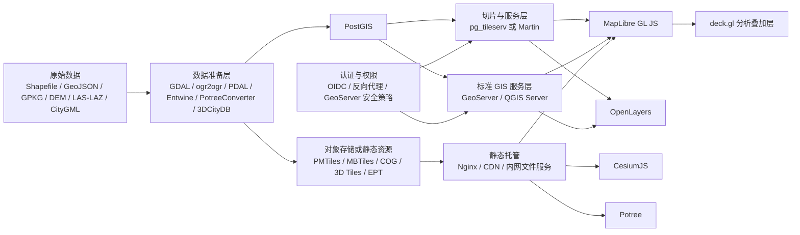

# 开发输变电工程数字沙盘 App 的开源免费 GIS 与地图技术选型分析报告

## 执行摘要

面向输变电工程数字沙盘，单一前端地图库通常很难同时把“海量二维矢量/栅格、三维场景、时序状态动画、点云细节、离线部署、OGC 标准集成、编辑与权限”全部做好。基于官方文档、GitHub 仓库与标准资料，最稳妥的工程结论不是“只选一个库”，而是按能力分层：**二维主界面优先选 MapLibre GL JS 或 OpenLayers，三维主沙盘优先选 CesiumJS，点云专项优先选 Potree，海量分析覆盖层优先用 deck.gl，后端以 PostGIS + 矢量切片服务/GeoServer/QGIS Server 组合提供数据能力**。其中，若团队更偏前端性能与现代 WebGL，宜以 **MapLibre GL JS + deck.gl + CesiumJS** 为主线；若团队更偏传统 GIS、OGC 协议与编辑流程，宜以 **OpenLayers + GeoServer/QGIS Server + PostGIS** 为主线。citeturn18search2turn3search2turn27search0turn2search0turn2search1turn27search3turn2search6turn14search3turn9view2turn19search1turn27search1turn12search3turn28search1turn5search1turn4search2turn4search0

如果把目标进一步压缩成一句话，面向“**Web 优先、预算有限、需长期演进**”的数字沙盘，推荐采用以下默认路线：**二维业务视图用 MapLibre GL JS，复杂统计/动画覆盖层用 deck.gl，三维主场景与 3D Tiles 用 CesiumJS，点云细节页或专项模块用 Potree，数据底座统一落到 PostGIS，对外通过 pg_tileserv/Martin 或 GeoServer 提供 MVT/WMS/WFS/WMTS/OGC API 服务**。这样可以把每个引擎放在最擅长的位置，避免用 Leaflet 硬扛三维，或用 CesiumJS 硬扛重型二维编辑。citeturn3search2turn27search0turn2search0turn3search1turn24search0turn24search2turn2search6turn14search1turn14search3turn9view2turn20search5turn22search0turn22search2turn4search0turn21search9turn5search1

在候选技术中，**Leaflet** 适合轻量、快速、低学习曲线的二维页面，但不适合做主三维沙盘；**OpenLayers** 在 OGC 协议、编辑、查询、矢量瓦片、传统 GIS 集成方面最均衡；**MapLibre GL JS** 在现代 Web 端矢量瓦片、GPU 渲染、PMTiles、2.5D 表达方面性价比最高；**CesiumJS** 是开源 Web 3D 地理引擎中的主力；**Potree** 仍然是大规模点云可视化的强专项方案；**deck.gl** 则是海量轨迹、热力、事件态势、时间动画的“性能加速器”。citeturn8view2turn11search0turn9view0turn12search1turn12search3turn8view0turn3search2turn13search3turn28search0turn8view3turn14search1turn14search2turn14search3turn9view2turn19search1turn8view1turn24search1turn24search2turn27search0

对电力行业格式兼容性的关键判断也很明确：**浏览器前端并不应该直接以 Shapefile、GeoPackage、CityGML、LAS/LAZ 作为主运行格式**。更稳妥的生产路线是：Shapefile/GPKG/GeoJSON 入库到 PostGIS 或预处理成 GeoJSON/MVT/PMTiles；DEM 处理为 COG、raster-dem 或地形服务；点云处理为 EPT/COPC/Potree 格式；CityGML 通过 3DCityDB 或 CityGML→3D Tiles 工具转换为 3D Tiles 后再进入 Web 前端。这样才能兼顾性能、缓存、权限、离线和运维。citeturn5search3turn15search12turn15search0turn4search0turn22search3turn13search3turn13search0turn20search2turn20search6turn9view2turn20search5turn23search4turn23search5turn23search7turn14search3

对工程推荐的优先级排序如下：**首推组合**为“MapLibre GL JS + deck.gl + CesiumJS + PostGIS + 矢量切片服务 + GeoServer（按需）”；**OGC/编辑优先组合**为“OpenLayers + GeoServer/QGIS Server + PostGIS”；**点云专项组合**为“Potree + CesiumJS”；**极轻量应急或运维页面**可选 Leaflet。若必须做桌面或离线版，建议优先采用“**Web 前端 + PMTiles/MBTiles/GeoPackage/本地静态资源 + Electron/Tauri 壳**”的方式；而不是一开始就投入重型原生客户端开发。citeturn8view0turn8view1turn8view3turn22search3turn22search2turn18search0turn5search1turn9view2turn7search7turn15search0turn15search14turn17search2

## 目标与关键需求维度

输变电工程数字沙盘与一般 Web 地图最大的差异，在于它同时需要承担“**工程总览 + 施工进度 + 设备状态 + 地形地貌 + 三维巡视 + 点云细节 + 离线交付**”多重职责。因此，选型不能只看是否能“显示地图”，而要看一整条链路：**格式进入方式、切片与预处理能力、前端渲染上限、二维三维的职责边界、离线打包难度、后端服务与权限模型、后续二次开发成本**。GeoPackage 标准本身可承载矢量、栅格与瓦片；PostGIS 可直接输出 MVT；3D Tiles 是大规模三维地理数据的开放标准；QGIS 既支持点云也支持 3D Tiles；GeoServer 与 QGIS Server 可分别提供 OGC 与标准地图服务；这些能力共同决定了沙盘系统是否能长期可维护。citeturn1search15turn4search0turn14search3turn23search2turn2search3turn5search1turn4search2turn21search9

从需求拆解看，以下维度最关键：**大规模矢量/栅格可视化**要求优先考虑 MVT、栅格切片、PMTiles、按需加载与 GPU 渲染；**二维/三维视图切换**要求二维与三维引擎职责清晰，避免一个引擎负担所有场景；**时序与状态动画**要求时间轴、轨迹动画或帧控制机制；**图层管理、属性查询与编辑**要求前端交互能力与后端要素服务能力配合；**离线/在线地图**要求静态包或单文件瓦片格式；**安全与权限**要求把认证授权放在服务层，而不是依赖前端库本身。citeturn21search9turn4search0turn22search3turn13search3turn14search1turn3search1turn12search3turn28search1turn18search0turn18search1

下面的表格把这些需求转成工程选型判据，便于直接落到实施层。

| 需求维度 | 选型判据与工程含义 |
|---|---|
| 大规模矢量渲染 | 前端应优先支持 MVT/矢量切片与 GPU 渲染；后端应支持 PostGIS `ST_AsMVT` 或专用切片服务；GeoServer 也可输出 MVT，但更适合与现有 OGC 体系协同。citeturn4search0turn2search0turn3search2turn21search9turn22search0turn22search2 |
| 大规模栅格与 DEM | 二维常用 XYZ/WMTS/COG，2.5D/3D 常用 raster-dem 或地形服务；QGIS 与 PostGIS/GDAL 在栅格入库和处理上更适合作为数据准备层。citeturn13search0turn5search2turn15search8turn16search13 |
| 三维主场景 | 3D Tiles 是开放标准，CesiumJS 最成熟；MapLibre 更适合 2.5D 地形/建筑挤出，而不适合作为复杂三维主场景唯一引擎。citeturn14search3turn14search9turn2search6turn13search1turn3search2 |
| 点云 | 浏览器点云专项优先看 Potree；若强调多图层融合与统一场景，可补充评估 deck.gl 或 iTowns，但 Potree 的点云专项能力依然最强。citeturn9view2turn19search1turn24search2turn16search12 |
| 属性查询与编辑 | OpenLayers 对 Draw/Modify/WMS GetFeatureInfo/WFS 查询链条最成熟；MapLibre 需要插件或自建编辑层；CesiumJS 不适合作为主二维编辑器。citeturn11search1turn12search3turn28search1turn13search2turn11search6turn14search2 |
| 离线/弱网络 | PMTiles、MBTiles、GeoPackage、静态 3D Tiles/EPT 是首选；Leaflet/MapLibre/OpenLayers 都能消费本地或内网静态资源。citeturn13search3turn22search3turn15search14turn17search2turn19search0turn19search5 |
| 常见行业格式 | 原始格式应先转换：Shapefile/GPKG→PostGIS/GeoJSON/MVT；LAS/LAZ→EPT/COPC/Potree；CityGML→3D Tiles。citeturn5search3turn15search12turn20search2turn20search5turn23search4turn23search7turn14search3 |
| 安全与权限 | 前端库本身不是权限系统；认证与授权应放在 GeoServer/QGIS Server/反向代理/API 网关层。citeturn18search0turn18search1turn18search2turn18search7 |
| 国际化 | 绝大多数 Web 地图库的业务 UI 由应用自行实现，因此中文优先并不构成根本障碍；QGIS 原生多语言支持最好。Leaflet 还有中文文档与可本地化的编辑插件。citeturn25search11turn25search3turn9view3 |

## 候选技术详述

### Leaflet

Leaflet 的核心优势是**轻量、简单、移动端友好、插件极其丰富**。官方仓库显示其主仓拥有约 44.9k stars，官方中文站强调其体积小、对移动端友好，并且拥有大量插件生态；许可为 BSD-2-Clause。对于需要快速做出“工程总览、设备点位、线路走向、工单/缺陷分布、基础图层开关”的二维页面，Leaflet 仍然是进入门槛最低的方案之一。citeturn8view2turn25search15turn25search11

在能力边界上，Leaflet 原生擅长 **2D 地图、GeoJSON、栅格瓦片、WMS/TMS**；属性查询与编辑通常依赖插件，典型代表是 **Leaflet.draw**；矢量瓦片则通常依赖 **Leaflet.VectorGrid**；GeoPackage 也有专门插件可在浏览器直接加载。也就是说，Leaflet 对电力行业常见格式并非“全都原生支持”，而是更适合通过“**GeoJSON/瓦片/插件**”方式接入。对 Shapefile、GPKG、矢量瓦片这类格式，工程上应视为“间接支持”，而不是把它当成重型 GIS 引擎来用。citeturn28search2turn17search1turn17search4turn17search0turn17search3turn17search2turn17search5

就输变电数字沙盘而言，Leaflet 的**匹配度高的场景**是：轻量 Web 2D 页面、移动巡检 H5、运维态势总览、离线内网地图浏览、低门槛原型验证。它的**短板**也很明显：三维能力几乎需要外接其它引擎；海量矢量和高帧率动态效果不如 MapLibre GL JS 与 deck.gl；复杂 OGC 协议链和重型编辑不如 OpenLayers；点云与 3D Tiles 更不是它的战场。综合来看，Leaflet 适合作为“**轻前端、轻交互、低成本**”备选，而不适合作为输变电数字沙盘的总引擎。citeturn8view2turn17search0turn17search1turn25search11

主要参考链接：Leaflet 官方文档与中文站、插件清单、VectorGrid、Leaflet.draw、GeoPackage 插件。citeturn0search8turn25search11turn11search0turn17search0turn17search1turn17search2

### OpenLayers

OpenLayers 是更偏“**传统 GIS 能力完整性**”的 Web 地图库。官方站点和仓库都明确强调它是高性能、功能完整的 Web 地图库，可以显示任意来源的地图瓦片、矢量数据与标记，许可为 BSD-2-Clause；GitHub 主仓约 12.4k stars，且 2026 年仍保持持续发布。citeturn0search1turn9view0turn10view2

它对输变电数字沙盘最重要的价值，在于**二维业务交互链路非常完整**：官方示例直接覆盖 Draw/Modify、WMS GetFeatureInfo、WFS GetFeature、WebGL points layer、WebGL vector tiles 等常见能力。也就是说，图层管理、要素编辑、属性查询、与 GeoServer/QGIS Server/PostGIS 的标准集成，OpenLayers 都有很成熟的路径。对于需要在电网线路、杆塔、站内设备、施工围栏、通道边界上做编辑、查询、联动的场景，OpenLayers 的匹配度非常高。citeturn11search1turn12search3turn28search1turn12search1turn3search3turn0search1

格式层面，OpenLayers 前端天然更适合消费 **GeoJSON、MVT、WMS、WFS、WMTS、XYZ** 等 Web 格式；Shapefile、GeoPackage 等一般通过服务端或预处理接入，而不是直接把原始文件长期放到浏览器作为主运行格式。它并不是强三维引擎，但在二维 GIS 和 2.5D 表达上能覆盖绝大多数工程业务界面。对于“**标准协议多、编辑多、与 GeoServer/QGIS Server 耦合深**”的团队，OpenLayers 往往是最好用的主 2D 引擎。citeturn12search2turn12search3turn28search1turn21search9turn5search1

它的主要不足在于：样式与现代前端开发体验不如 MapLibre GL JS 统一简洁；真正的复杂三维不如 CesiumJS；点云不如 Potree；如果团队主要诉求是“现代矢量切片+漂亮样式+高性能前端态势”，那 MapLibre GL JS 会更顺手。但如果你的核心诉求是“**OGC 标准、查询、编辑、GIS 工程完整性**”，OpenLayers 仍然是最稳的一档。citeturn3search2turn2search6turn9view2

主要参考链接：OpenLayers 官方主页、GitHub 仓库、编辑与查询示例、WebGL/矢量切片示例。citeturn0search1turn9view0turn11search1turn12search1turn12search3turn3search3

### MapLibre GL JS

MapLibre GL JS 是当前开源免费 Web 地图中**最适合现代矢量切片主界面**的方案之一。官方文档明确说明它使用 WebGL 在浏览器中渲染矢量瓦片，官方主页也强调其 GPU 加速、可做 globe、3D terrain、建筑挤出、自定义 3D layer，许可文件体现为 BSD-3-Clause；GitHub 主仓约 10.5k stars，2026 年仍在高频迭代。citeturn18search2turn3search2turn26view0turn10view0turn7search4

对于输变电数字沙盘，MapLibre GL JS 的核心价值是：**海量二维底图与专题图层的性能非常好**，并且风格统一、样式表达强、前端工程生态好。它天然适合消费 **MVT、PMTiles、GeoJSON、raster、raster-dem**，还可通过 WMS raster source 方式叠加传统地图服务；与 deck.gl 的集成模式也是官方支持的。对“线路走廊、设备点位、缺陷热区、进度分区、告警动画、2.5D 站区建筑挤出、地形起伏”这类场景，MapLibre 非常合适。citeturn13search3turn22search3turn28search0turn13search0turn13search1turn27search0

部署层面，它还拥有官方体系中的 **MapLibre Native**，可用于移动与桌面应用内嵌地图；这使它在“Web 主前端 + WebView/桌面壳”的策略下非常有吸引力。另一方面，它的不足也很清楚：复杂要素编辑通常要靠插件或自建机制；真正的大尺度三维地理引擎能力仍不如 CesiumJS；直接承载 EPT/COPC 点云也不是主路线。因此，MapLibre 最理想的角色是“**数字沙盘的主 2D/2.5D 界面**”，而不是三维与点云的一体化总引擎。citeturn7search7turn11search6turn13search2turn2search6turn9view2

主要参考链接：MapLibre 官方文档、项目主页、GitHub 仓库、Terrain/3D/WMS/PMTiles 示例、Native 项目页。citeturn18search2turn3search2turn8view0turn13search0turn13search1turn28search0turn13search3turn7search7

### CesiumJS

CesiumJS 是本次选型中**最适合作为 Web 三维主沙盘引擎**的开源方案。官方站点和 GitHub 仓库都明确说明它是开源 JavaScript 库，可在浏览器中创建高性能的 3D 地球与地图，许可为 Apache-2.0，且专门面向大规模地理数据互操作与流式可视化；GitHub 主仓约 15.2k stars。citeturn2search6turn8view3turn18search7

从能力上看，CesiumJS 直接覆盖了数字沙盘中的大量关键需求：它支持 **2D/3D/Columbus View** 场景模式切换；有 **Clock** 机制控制时间推进与动画；支持 **GeoJSON/TopoJSON** 数据源，API 索引还给出了 **CzmlDataSource、KmlDataSource、GpxDataSource** 等类型；最关键的是，它与 **3D Tiles** 这一开放标准深度耦合，而 3D Tiles 本身就是为“流式传输大规模异构三维地理数据”设计的。对输变电工程中的“站区三维、杆塔/导地线模型、施工过程动画、无人机时序轨迹、三维地形、BIM/CAD/摄影测量融合”，CesiumJS 几乎是天然对口。citeturn14search0turn14search1turn14search2turn18search3turn14search3turn4search7turn14search9

需要注意的是，CesiumJS 并不等于“前端全部问题都用它解决”。它做二维业务编辑界面并不如 OpenLayers 顺手，做现代矢量切片式的高密度业务 UI 也不如 MapLibre GL JS 轻巧。最合理的工程策略通常是：**把 CesiumJS 作为主三维场景与 3D Tiles 引擎，二维管理与编辑入口放在 MapLibre 或 OpenLayers 中**。另外，Cesium 提供商业的 Cesium ion，但官方仓库也明确说明你可以自由使用离线或在线其它数据源，因此在“必须开源免费”的前提下，可以直接采用自托管 3D Tiles、地形与影像数据，而不依赖商业服务。citeturn8view3turn2search6turn27search6

主要参考链接：CesiumJS 官方页、GitHub 仓库、API 文档、Sandcastle、3D Tiles 标准与示例数据仓库。citeturn2search6turn8view3turn14search1turn14search2turn19search8turn14search3turn19search0

### Potree

Potree 是**点云专项能力最强**的候选之一。官方仓库和官网都把它定义为“面向大规模点云的 WebGL 点云渲染器”，适合超大点云的浏览、剖面、测量、分类显示与相机/路径等点云工作流。它的许可证文本是 BSD 风格；GitHub 主仓约 5.4k stars。citeturn9view2turn1search4turn25search2turn10view3

对输变电场景来说，Potree 的价值非常具体：当你需要展示 **激光点云、走廊精细模型、站区实景扫描、塔基/构筑物高精度复核** 时，Potree 远比通用地图引擎更顺手。官方仓库示例直接覆盖 **EPT、LAS、LAZ、多个点云同时加载、剖面、测量、相机动画、与 Cesium 联动** 等能力，PotreeConverter 也提供了面向 Web 渲染的多分辨率八叉树结构，并在 2.0 版本宣称相较旧版有数量级上的性能和文件组织改进。citeturn19search1turn19search5turn20search5

但 Potree 的边界也必须讲清楚：它不是完整的二维 GIS 平台，不是 OGC 协议客户端，也不适合作为企业级业务前端的唯一底座；其主仓发布节奏相对慢，最近公开 release 主要停留在 2023 年，社区活跃度显著弱于 MapLibre、OpenLayers、deck.gl 和 CesiumJS。因此，更合理的定位是“**点云专项引擎**”——把它嵌入数字沙盘中的点云页面、详情页或专家模式，而不是让它承担全站地图与业务流程。citeturn10view3turn9view2turn19search1

主要参考链接：Potree GitHub 仓库、官网与示例页、EPT 示例、PotreeConverter 仓库与 Getting Started。citeturn9view2turn1search4turn19search1turn19search5turn20search5turn20search4

### deck.gl

deck.gl 不是传统意义上的“地图底图库”，而是**面向大规模数据可视化的 GPU 图层框架**。官方仓库与官网明确强调它用于高性能 WebGL2/WebGPU 可视化，支持大量现成图层，并且高度可扩展；许可为 MIT，GitHub 主仓约 14.1k stars，2026 年仍在持续发布。citeturn8view1turn3search8turn25search5turn10view1

它对输变电数字沙盘的价值主要体现在“**分析层与动态层**”：GeoJsonLayer 可处理常规矢量要素；MVTLayer 面向大数据量矢量瓦片；TripsLayer 非常适合施工车辆、巡检轨迹、故障演化路径等时间动画；TerrainLayer 可用高度图重建地形；PointCloudLayer 可渲染三维点云；Tile3DLayer 则可以消费 3D Tiles。再加上它与 MapLibre 的官方集成路径已经成熟，所以 deck.gl 最适合承担“**海量叠加分析**”的职责，而不是去做完整的 GIS 编辑客户端。citeturn24search1turn2search0turn3search1turn24search0turn24search2turn1search1turn27search0

缺点也要实话实说：deck.gl 没有 OpenLayers 那样完整的 OGC 客户端与编辑工作流，也没有 CesiumJS 那样完整的三维地理引擎语义。它更像是“**性能放大器**”——当 MapLibre 或其它底图引擎已经负责地图与交互框架时，用 deck.gl 补齐高帧率、高数据量、强动画的态势层。所以，对输变电沙盘来说，deck.gl 的最佳角色是“主 2D/2.5D 引擎的增强层”，尤其适合告警事件流、设备状态闪烁、车辆/无人机轨迹、密度分布、热区与统计图层。citeturn27search0turn8view1turn3search1turn24search13

主要参考链接：deck.gl 官方主页、GitHub 仓库、GeoJsonLayer/MVTLayer/TripsLayer/TerrainLayer/PointCloudLayer/Tile3DLayer、MapLibre 集成文档。citeturn3search8turn8view1turn24search1turn2search0turn3search1turn24search0turn24search2turn1search1turn27search0

### 候选技术特性对比表

| 技术 | 核心定位 | 2D / 3D / 点云 / 矢量瓦片 | 常见格式兼容性 | 许可与社区活跃度 | 与电力行业需求匹配度 |
|---|---|---|---|---|---|
| Leaflet | 轻量 2D 交互地图 | 2D 强；原生 3D 弱；点云无；矢量瓦片依赖 VectorGrid。citeturn8view2turn17search0 | GeoJSON、WMS/TMS 很顺；GPKG、矢量瓦片、编辑依赖插件；Shapefile 更建议预处理。citeturn28search2turn17search2turn17search1 | BSD-2；主仓约 44.9k stars；生态极大。citeturn8view2turn25search15 | 适合轻量总览/移动巡检；不适合主三维沙盘。 |
| OpenLayers | OGC/查询/编辑优先的 Web GIS | 2D 极强；2.5D 中等；点云弱；MVT/WebGL 强。citeturn12search1turn3search3 | GeoJSON、MVT、WMS/WFS/WMTS 原生路径成熟；Shapefile/GPKG 走服务端或预处理。citeturn12search3turn28search1turn21search9 | BSD-2；主仓约 12.4k stars；2026 仍持续发布。citeturn10view2turn0search1 | 若重查询、编辑、标准服务与图层治理，匹配度很高。 |
| MapLibre GL JS | 现代 Web 矢量切片主界面 | 2D/2.5D 强；地形/建筑挤出强；完整 3D 弱于 Cesium；点云非主线。citeturn3search2turn13search0turn13search1 | MVT、GeoJSON、PMTiles、raster、raster-dem 很强；WMS 可叠加。citeturn13search3turn22search3turn28search0 | BSD-3；主仓约 10.5k stars；2026 高频发布。citeturn26view0turn10view0turn7search4 | Web 主界面首选之一，特别适合海量二维与 2.5D。 |
| CesiumJS | Web 三维主沙盘引擎 | 3D 极强；2D/3D 可切换；3D Tiles 原生；点云可通过 3D Tiles。citeturn14search0turn14search3turn14search9 | GeoJSON/TopoJSON，且 API 提供 CZML/KML/GPX/3D Tiles/terrain 等路径。citeturn14search2turn18search3turn2search6 | Apache-2.0；主仓约 15.2k stars。citeturn8view3 | 站区三维、施工时序、地形、摄影测量、BIM/CAD 融合最佳。 |
| Potree | 点云专项可视化 | 点云极强；2D/通用 GIS 弱；可与 Cesium 联动。citeturn19search1turn9view2 | EPT/LAS/LAZ/Potree 格式路径成熟；适合点云预处理后浏览。citeturn19search5turn20search5turn20search2 | BSD 风格；主仓约 5.4k stars；公开 release 节奏较慢。citeturn25search2turn10view3 | 点云巡视、精模复核、剖面量测非常适合；不宜做总前端。 |
| deck.gl | 海量分析叠加与动画框架 | 2D/3D 分析层强；Trips/Terrain/PointCloud/Tile3D 都有；不以 GIS 编辑见长。citeturn24search1turn3search1turn24search0turn24search2turn1search1 | GeoJSON、MVT、3D Tiles、点云、高度图等路径成熟。citeturn24search1turn2search0turn1search1turn24search2 | MIT；主仓约 14.1k stars；2026 持续发布。citeturn10view1turn25search5 | 最适合告警态势、轨迹动画、密度热区、分析覆盖层。 |

## 组合方案与架构

对输变电数字沙盘，真正决定成败的不是“前端库名字”，而是**数据准备层—服务层—渲染层—权限层**是否解耦。Shapefile、GeoJSON、GeoPackage、DEM、LAS/LAZ、CityGML 属于“输入格式”；进入生产系统前，应分别转换为 PostGIS 表、MVT/PMTiles、raster/COG/raster-dem、EPT/COPC/Potree、3D Tiles 等“运行格式”；权限认证放在 GeoServer/QGIS Server/反向代理/API 网关层；再由 MapLibre/OpenLayers/Cesium/Potree/deck.gl 各自消费最合适的数据产物。citeturn15search12turn15search0turn5search3turn5search2turn20search2turn20search5turn23search4turn23search7turn4search0turn21search9turn18search0turn18search1

下面这张图是比较适合中等团队、Web 优先、开源免费前提下的推荐架构。



### 轻量 Web 2D 方案

这一方案以 **MapLibre GL JS + PMTiles 或 pg_tileserv/Martin + PostGIS** 为主，必要时叠加 deck.gl。优点是前端体验现代、矢量切片性能好、离线与云端都容易做、前后端边界清晰，尤其适合“线路、杆塔、设备、告警、施工区、工单”的二维主界面。PMTiles 还可以把瓦片打成单文件，显著降低离线包与运维复杂度。风险主要在于编辑与复杂 OGC 工作流要额外设计；若业务后期需要大量 WFS/WMS/编辑链路，可能要补上 GeoServer/OpenLayers。citeturn3search2turn13search3turn22search3turn22search2turn22search0turn4search0turn27search0

### OGC 与编辑优先方案

这一方案以 **OpenLayers + GeoServer 或 QGIS Server + PostGIS** 为主。优点是标准协议最完整，WMS/WFS/WMTS/OGC API Features、要素查询、属性编辑、图层治理都更成熟，对传统 GIS 团队更友好。若企业内部已经有 GeoServer/QGIS Server 基础设施，这条路线的组织适配成本通常最低。风险是前端样式与现代 WebGL 体验略逊于 MapLibre；如果后续要做大规模 2.5D/三维主沙盘，仍要引入 CesiumJS。citeturn11search1turn12search3turn28search1turn21search9turn5search1turn4search2

### Web 三维主沙盘方案

这一方案以 **CesiumJS + 自托管 3D Tiles/terrain/imagery + PostGIS/GeoServer 辅助二维服务** 为主。优点是三维能力最强，适合站区三维、走廊三维、时序施工动画、视域/量测、倾斜摄影、BIM/CAD/摄影测量融合。对 CityGML 等格式的正解不是直接前端加载，而是先用 3DCityDB 或 CityGML→3D Tiles 工具转换，再交给 CesiumJS。风险在于三维内容准备链更长，前端调优与数据生产要求更高。citeturn2search6turn14search1turn14search3turn23search4turn23search5turn23search7

### 点云与精细巡检方案

这一方案以 **Potree + EPT/COPC/Potree 格式 + CesiumJS 联动** 为主。它最适合站区实景扫描、走廊点云复核、线路与障碍物关系分析、量测与剖面等精细场景。优点是点云性能和工具性强；缺点是整体业务界面能力弱、社区节奏慢、不适合承担全站地图。最合理的落地方式通常是把 Potree 作为“点云详情页 / 专家模式”，与主沙盘共享坐标、设备 ID 和场景入口。citeturn9view2turn19search1turn19search5turn20search5

### 方案优劣对比表

| 方案 | 推荐组合 | 性能 | 开发难度 | 可维护性 | 成本 | 扩展性 | 主要风险 | 适合场景 |
|---|---|---|---|---|---|---|---|---|
| 轻量 Web 2D | MapLibre GL JS + PMTiles/pg_tileserv/Martin + PostGIS + 可选 deck.gl | 很高，尤其适合 MVT/PMTiles 和业务主题层。citeturn3search2turn22search3turn22search2turn27search0 | 中 | 高 | 低到中 | 高 | 编辑链与 OGC 深集成需补足 | 线路/设备/告警/施工二维主界面 |
| OGC 与编辑优先 | OpenLayers + GeoServer/QGIS Server + PostGIS | 高，但更偏 GIS 完整性而非极致前端样式。citeturn27search1turn21search9turn5search1 | 中到高 | 高 | 中 | 高 | 前端视觉与现代矢量样式体系不如 MapLibre 轻巧 | 管理端、配置端、编辑端、标准 GIS 集成 |
| Web 三维主沙盘 | CesiumJS + 3D Tiles + terrain + 辅助二维服务 | 高，尤其适合三维大场景与流式 LOD。citeturn2search6turn14search3turn14search9 | 高 | 中 | 中到高 | 高 | 数据准备链更长，三维调优成本高 | 站区三维、走廊三维、施工时序动画 |
| 点云与精细巡检 | Potree + EPT/COPC/Potree + CesiumJS 联动 | 点云专项极高。citeturn9view2turn19search5turn20search2 | 中到高 | 中 | 中 | 中 | 不适合承担全站业务与二维 GIS | 点云浏览、量测、剖面、精细复核 |

从工程落地角度，我更推荐**“双前端引擎策略”**：**主业务二维界面选 MapLibre GL JS 或 OpenLayers，主三维场景选 CesiumJS，点云细节再用 Potree**。这样虽然不是“一个库搞定一切”，但总复杂度反而更低，因为它遵循了各技术的天然边界。这个建议属于基于官方能力边界做出的工程推断，而不是单纯追求技术栈数量最少。citeturn3search2turn27search1turn2search6turn9view2

## 最小可运行示例与部署步骤

下面的示例都刻意保持“**足够小、能快速复现**”。示例强调的是**最短可跑路径**，不是生产代码。生产环境请固定版本、引入构建工具、做资源缓存、配置 CORS、统一坐标系与鉴权。Leaflet、OpenLayers、MapLibre、CesiumJS、Potree、deck.gl 的官方文档都给出了从 CDN 或 npm 起步的路径；GeoServer 也提供了 CORS 配置与矢量瓦片服务路径。citeturn8view2turn9view0turn8view0turn19search8turn9view2turn8view1turn21search7

### 数据准备的最小原则

如果你要让工程师最快复现，数据可按以下最小原则准备：

| 数据类型 | 最小样本建议 | 生产预处理建议 |
|---|---|---|
| 线路/站点/设备 | 一个几十行以内的 GeoJSON 文件，或直接内嵌到 HTML 中。 | Shapefile/GPKG 先转 PostGIS 或 GeoJSON/MVT。citeturn5search3turn15search12turn4search0 |
| 底图与专题瓦片 | 开发阶段可先接公开 OSM/示例瓦片。 | 生产建议 MVT/PMTiles/内网 WMTS。citeturn22search3turn21search9 |
| DEM | 小范围 raster-dem 或一个地形示例链接。 | 生产建议 COG / raster-dem / terrain 服务。citeturn13search0turn24search0turn5search2 |
| 3D 模型/场景 | 一个官方 3D Tiles sample tileset。 | CityGML 先转 3D Tiles；BIM/CAD 也尽量转成 3D Tiles。citeturn19search0turn23search7turn14search3 |
| 点云 | 一个小型 LAS/LAZ 样本。 | LAS/LAZ 先转 EPT/COPC/Potree 格式。citeturn20search2turn20search5turn19search5 |

### Leaflet 最小示例

**依赖**：`leaflet`，如需编辑可加 `Leaflet.draw`，如需 GeoPackage 可加 `leaflet-geopackage`，如需矢量瓦片可加 `Leaflet.VectorGrid`。官方起步方式既支持 CDN 也支持常规前端工程接入。citeturn8view2turn17search1turn17search2turn17search0

```html
<!doctype html>
<html>
<head>
  <meta charset="utf-8" />
  <title>leaflet-min</title>
  <link rel="stylesheet" href="https://unpkg.com/leaflet/dist/leaflet.css" />
  <style>#map{height:100vh;margin:0;}</style>
</head>
<body>
<div id="map"></div>
<script src="https://unpkg.com/leaflet/dist/leaflet.js"></script>
<script>
  const map = L.map('map').setView([30.67, 104.06], 11);

  L.tileLayer('https://tile.openstreetmap.org/{z}/{x}/{y}.png', {
    attribution: '© OpenStreetMap'
  }).addTo(map);

  const lineGeoJson = {
    "type": "FeatureCollection",
    "features": [{
      "type": "Feature",
      "properties": {"name": "220kV 示例线路", "status": "施工中"},
      "geometry": {
        "type": "LineString",
        "coordinates": [[104.02,30.63],[104.08,30.67],[104.14,30.70]]
      }
    }]
  };

  L.geoJSON(lineGeoJson, {
    onEachFeature: (f, layer) =>
      layer.bindPopup(`${f.properties.name}<br/>状态：${f.properties.status}`)
  }).addTo(map);
</script>
</body>
</html>
```

**部署步骤**：把文件保存为 `index.html` 后，用任意静态服务器启动，例如 `npx serve .`。本地不要直接双击打开复杂文件应用，因为后续加载外部 GeoJSON、GPKG 或插件资源通常需要 HTTP 服务。生产环境建议放到 Nginx 或内网静态服务上；若叠加 GeoServer 图层，要提前配置 CORS。citeturn9view0turn21search7

### OpenLayers 最小示例

**依赖**：`ol`。官方仓库直接给出了 `npm install ol` 与 Vite/Rollup/webpack 等打包方式；编辑与修改交互可直接使用官方 Draw/Modify 示例路径。citeturn9view0turn11search1

`index.html`

```html
<!doctype html>
<html>
<head>
  <meta charset="utf-8" />
  <title>ol-min</title>
  <style>html,body,#map{margin:0;height:100%;}</style>
</head>
<body>
<div id="map"></div>
<script type="module" src="./main.js"></script>
</body>
</html>
```

`main.js`

```js
import Map from 'ol/Map.js';
import View from 'ol/View.js';
import TileLayer from 'ol/layer/Tile.js';
import OSM from 'ol/source/OSM.js';
import VectorSource from 'ol/source/Vector.js';
import VectorLayer from 'ol/layer/Vector.js';
import GeoJSON from 'ol/format/GeoJSON.js';
import Draw from 'ol/interaction/Draw.js';
import Modify from 'ol/interaction/Modify.js';
import {fromLonLat} from 'ol/proj.js';

const source = new VectorSource({
  features: new GeoJSON().readFeatures({
    type: 'FeatureCollection',
    features: [{
      type: 'Feature',
      properties: {name: '变电站A'},
      geometry: {type: 'Point', coordinates: [104.06, 30.67]}
    }]
  }, {featureProjection: 'EPSG:3857'})
});

const vectorLayer = new VectorLayer({ source });

const map = new Map({
  target: 'map',
  layers: [
    new TileLayer({ source: new OSM() }),
    vectorLayer
  ],
  view: new View({
    center: fromLonLat([104.06, 30.67]),
    zoom: 11
  })
});

map.addInteraction(new Draw({ source, type: 'LineString' }));
map.addInteraction(new Modify({ source }));
```

**部署步骤**：

```bash
npm init -y
npm install ol vite
npx vite
```

**生产建议**：若要接 GeoServer/QGIS Server，优先走 WMS/WFS/WMTS/MVT；若要高性能大数据，优先切到 MVT 或 PostGIS MVT 输出。需要点击查询时，可参考官方 WMS GetFeatureInfo / WFS GetFeature 示例。citeturn12search3turn28search1turn4search0

### MapLibre GL JS 最小示例

**依赖**：`maplibre-gl`；若要离线/单文件瓦片，可再加 `pmtiles`。官方示例已覆盖 PMTiles、WMS、3D terrain 和 3D building。citeturn8view0turn13search3turn28search0turn13search0turn13search1

```html
<!doctype html>
<html>
<head>
  <meta charset="utf-8" />
  <title>maplibre-min</title>
  <link href="https://unpkg.com/maplibre-gl@latest/dist/maplibre-gl.css" rel="stylesheet" />
  <style>html,body,#map{margin:0;height:100%;}</style>
</head>
<body>
<div id="map"></div>
<script src="https://unpkg.com/maplibre-gl@latest/dist/maplibre-gl.js"></script>
<script>
  const map = new maplibregl.Map({
    container: 'map',
    style: {
      version: 8,
      sources: {
        osm: {
          type: 'raster',
          tiles: ['https://tile.openstreetmap.org/{z}/{x}/{y}.png'],
          tileSize: 256
        },
        station: {
          type: 'geojson',
          data: {
            type: 'FeatureCollection',
            features: [{
              type: 'Feature',
              properties: {name: '500kV 示例站', height: 80},
              geometry: {type: 'Point', coordinates: [104.06, 30.67]}
            }]
          }
        }
      },
      layers: [
        {id: 'osm', type: 'raster', source: 'osm'},
        {
          id: 'station-circle',
          type: 'circle',
          source: 'station',
          paint: {'circle-radius': 8}
        }
      ]
    },
    center: [104.06, 30.67],
    zoom: 11,
    pitch: 45
  });

  map.on('click', 'station-circle', e => {
    const p = e.features[0].properties;
    new maplibregl.Popup()
      .setLngLat(e.lngLat)
      .setHTML(`${p.name}`)
      .addTo(map);
  });
</script>
</body>
</html>
```

**如果想做离线版本**，把 GeoJSON 替换成本地文件，把底图改成 PMTiles 或内网矢量瓦片。**如果想做地形**，参考官方 `raster-dem` 示例；**如果想叠加传统服务**，用官方 WMS source 示例即可。生产建议固定版本，不要直接依赖 `latest`。citeturn13search3turn13search0turn28search0

### CesiumJS 最小示例

**依赖**：`cesium`。官方 Sandcastle 与 API 文档提供了最短起步路径，且官方示例代码可在 Apache 2.0 下使用。citeturn19search8turn14search1turn14search2

```html
<!doctype html>
<html>
<head>
  <meta charset="utf-8" />
  <title>cesium-min</title>
  <script src="https://unpkg.com/cesium/Build/Cesium/Cesium.js"></script>
  <link rel="stylesheet" href="https://unpkg.com/cesium/Build/Cesium/Widgets/widgets.css" />
  <style>html,body,#viewer{margin:0;height:100%;width:100%;}</style>
</head>
<body>
<div id="viewer"></div>
<script>
  const viewer = new Cesium.Viewer('viewer', {
    timeline: true,
    animation: true
  });

  viewer.clock.shouldAnimate = true;

  Cesium.GeoJsonDataSource.load({
    type: 'FeatureCollection',
    features:[{
      type:'Feature',
      properties:{name:'施工塔位-01'},
      geometry:{type:'Point', coordinates:[104.06,30.67]}
    }]
  }).then(ds => {
    viewer.dataSources.add(ds);
    viewer.flyTo(ds);
  });

  // 如需 3D Tiles，把下面这一段替换上去：
  // Cesium.Cesium3DTileset.fromUrl('./tileset/tileset.json').then(tileset => {
  //   viewer.scene.primitives.add(tileset);
  //   viewer.zoomTo(tileset);
  // });
</script>
</body>
</html>
```

**数据准备**：最小复现可先用内嵌 GeoJSON。要测试 3D Tiles，可直接下载官方 `3d-tiles-samples` 中的小样本，放到 `./tileset/` 目录并通过本地 HTTP 服务器提供。若你手上是 CityGML，则不要直接塞进前端，而应先转换为 3D Tiles。citeturn19search0turn23search7turn23search4turn14search3

**生产建议**：三维资源尽量静态托管或对象存储托管；如果需要时间动画，用 `Clock`、CZML 或业务时间轴组件驱动。citeturn14search1turn18search3

### Potree 最小示例

**依赖**：`potree` 构建产物；数据建议使用 PotreeConverter 或 Entwine 准备成 Potree/EPT 格式。官方仓库的 `ept.html` 与 Getting Started 页面给出了最短起步路径。citeturn9view2turn19search5turn20search4turn20search5turn20search2

```html
<!doctype html>
<html>
<head>
  <meta charset="utf-8" />
  <title>potree-min</title>
  <link rel="stylesheet" href="./potree/build/potree/potree.css">
  <style>html,body,#potree_render_area{margin:0;width:100%;height:100%;}</style>
</head>
<body>
  <div id="potree_render_area"></div>

  <script src="./potree/build/potree/potree.js"></script>
  <script type="module">
    window.viewer = new Potree.Viewer(document.getElementById("potree_render_area"));
    viewer.setEDLEnabled(true);
    viewer.setFOV(60);
    viewer.setPointBudget(1_000_000);

    Potree.loadPointCloud("./pointcloud/ept.json", "sample", function(e){
      viewer.scene.addPointCloud(e.pointcloud);
      e.pointcloud.material.pointSizeType = Potree.PointSizeType.ADAPTIVE;
      viewer.fitToScreen();
    });
  </script>
</body>
</html>
```

**数据准备**：如果你有 `sample.las`，可先用 PotreeConverter 或 Entwine 转换，然后把生成的目录放到 `./pointcloud/`。citeturn20search5turn20search2

**部署步骤**：用静态服务器发布整个目录即可。官方明确建议通过 Web 服务器访问，不要直接从文件系统打开 HTML。生产环境建议把点云与主业务前端分离部署，避免主应用包过重。citeturn20search4turn9view2

### deck.gl 最小示例

**依赖**：`deck.gl`；若与底图叠加，推荐同时使用 MapLibre。官方已经给出了 MapLibre 的 `interleaved / overlaid / reverse-controlled` 三种集成方式。citeturn8view1turn27search0

```html
<!doctype html>
<html>
<head>
  <meta charset="utf-8" />
  <title>deckgl-min</title>
  <style>html,body,#app{margin:0;height:100%;}</style>
</head>
<body>
<div id="app"></div>
<script src="https://unpkg.com/deck.gl@latest/dist.min.js"></script>
<script>
  const lineData = [{
    waypoints: [
      {coordinates:[104.02,30.63], timestamp:0},
      {coordinates:[104.08,30.67], timestamp:10},
      {coordinates:[104.14,30.70], timestamp:20}
    ]
  }];

  let currentTime = 0;

  const layer = new deck.TripsLayer({
    id: 'trip',
    data: lineData,
    getPath: d => d.waypoints.map(p => p.coordinates),
    getTimestamps: d => d.waypoints.map(p => p.timestamp),
    getColor: [255, 140, 0],
    opacity: 0.8,
    widthMinPixels: 5,
    rounded: true,
    trailLength: 10,
    currentTime
  });

  const deckgl = new deck.DeckGL({
    container: 'app',
    controller: true,
    initialViewState: {
      longitude: 104.06,
      latitude: 30.67,
      zoom: 11,
      pitch: 45,
      bearing: 0
    },
    layers: [layer]
  });

  function animate(){
    currentTime = (currentTime + 0.2) % 20;
    deckgl.setProps({
      layers: [layer.clone({currentTime})]
    });
    requestAnimationFrame(animate);
  }
  animate();
</script>
</body>
</html>
```

**数据准备**：若只是验证动画能力，直接内嵌小样本即可；若是生产态势图层，建议基于 GeoJSON/MVT/业务 API 的标准结果构建。生产中通常把 deck.gl 作为 MapLibre 的增强层，而不是完全单独使用。citeturn3search1turn24search1turn2search0turn27search0

### 示例依赖与步骤汇总表

| 技术/方案 | 最少依赖 | 最小数据样本 | 本地启动 | 生产建议 |
|---|---|---|---|---|
| Leaflet | `leaflet`；按需加 `Leaflet.draw`/`VectorGrid`/`leaflet-geopackage`。citeturn8view2turn17search1turn17search0turn17search2 | 内嵌 GeoJSON | `npx serve .` | 适合轻量页面；大数据不要直接堆 GeoJSON。 |
| OpenLayers | `ol` + `vite` | GeoJSON 或 WMS/WFS 示例数据 | `npx vite` | 适合编辑端、GIS 管理端、OGC 服务接入。citeturn9view0turn12search3turn28search1 |
| MapLibre | `maplibre-gl`；离线可加 `pmtiles` | GeoJSON / MVT / PMTiles | 静态服务器即可 | 主 2D/2.5D 界面优先；版本请锁定。citeturn13search3turn22search3 |
| CesiumJS | `cesium` | GeoJSON 或小型 `tileset.json` | 静态服务器即可 | 3D Tiles 静态托管；CityGML 先转换。citeturn19search0turn23search7 |
| Potree | `potree` 构建产物 | `ept.json` 或 PotreeConverter 输出 | 静态服务器即可 | 作为点云专项模块，避免承担全站业务。citeturn19search5turn20search5 |
| deck.gl | `deck.gl`；常配 MapLibre | 内嵌轨迹或 GeoJSON | 静态服务器即可 | 作为分析/动画叠加层最合适。citeturn27search0turn24search1turn3search1 |

## 结论与推荐

如果只能给一个“最像真实生产”的推荐，我会推荐如下基线：

**推荐基线栈**
- **二维主界面**：MapLibre GL JS  
- **高性能分析层/时序层**：deck.gl  
- **三维主沙盘**：CesiumJS  
- **点云专项**：Potree  
- **空间数据库**：PostGIS  
- **切片服务**：pg_tileserv 或 Martin；若已有传统 GIS 基础设施，则保留 GeoServer  
- **标准协议与权限**：GeoServer / QGIS Server + 反向代理认证  
- **数据准备链**：GDAL / ogr2ogr、PDAL / Entwine / PotreeConverter、3DCityDB 或 CityGML→3D Tiles 工具。citeturn3search2turn27search0turn2search6turn9view2turn4search0turn22search0turn22search2turn18search0turn5search1turn5search3turn20search2turn20search5turn23search4turn23search7

这套组合的最大优点，是**把技术放在正确的职责位**。MapLibre GL JS 负责“看图好看、底图高效、业务图层顺滑”；deck.gl 负责“告警、轨迹、热力、分析动画”；CesiumJS 负责“站区三维、走廊三维、施工过程、3D Tiles”；Potree 负责“点云精细复核”；PostGIS 负责“统一业务空间底座”；服务层负责“权限、缓存、标准协议与部署”。这比强行用一个库覆盖全部需求更可靠。citeturn3search2turn27search0turn2search6turn9view2turn4search0turn18search0

若团队是**传统 GIS 能力强于前端**，推荐把基线切换为：**OpenLayers + GeoServer/QGIS Server + PostGIS + CesiumJS**。这条路线的优点是 OGC、编辑、服务治理更成熟，尤其适合内部管理系统、设备台账维护、图层发布与审查流程。MapLibre 适合更“产品化”和“现代 Web 优先”的前台；OpenLayers 适合更“GIS 平台化”和“工作台优先”的后台。citeturn27search1turn21search9turn5search1turn2search6

若项目初期资源有限，我建议分两期实施。**第一期**只做二维主界面与状态动画，采用 **MapLibre GL JS + PostGIS + PMTiles/MVT**，把数据底座和事件模型建立起来；**第二期**再增补 CesiumJS 三维场景与 Potree 点云模块。这条路线的 ROI 往往最高，因为数字沙盘里真正最常用的入口，通常仍然是二维看板、列表联动、状态筛选和简单空间查询，而不是全时开启三维。这个判断是工程经验推断，但与上文所列各引擎的能力边界是吻合的。citeturn3search2turn22search3turn4search0turn2search6turn9view2

最后给出一句**明确的选型结论**：

- **不要**把 Leaflet 当成主三维或主海量矢量引擎。  
- **不要**把 CesiumJS 当成主二维编辑工作台。  
- **不要**把原始 Shapefile、GeoPackage、CityGML、LAS/LAZ 直接作为浏览器生产运行格式。  
- **要**把运行格式统一为 **GeoJSON/MVT/PMTiles/COG/3D Tiles/EPT**。  
- **要**把权限与认证放到 **服务层**。  
- **要**接受“二维主界面 + 三维主沙盘 + 点云专项”的分层架构。citeturn17search0turn2search6turn5search3turn23search4turn20search2turn14search3turn18search0turn18search1

## 开放问题与限制

本文的结论主要建立在**官方文档、标准文档、GitHub 仓库元数据与官方示例**之上，足够支持架构级选型；但它**没有替代真实业务数据集上的基准测试**。尤其是以下问题，仍建议在你的样本数据上做 PoC：单站区/单走廊真实数据量下的帧率、点云与三维模型并发加载策略、国产化浏览器兼容性、中文符号与字体栈、离线安装包大小、权限模型与审计要求。Potree 的社区节奏也相对较慢，如果你的点云需求非常长期且想尽量减少专项组件数量，可以把 deck.gl 或 iTowns 作为二线备选做进一步验证，但从当前证据看，Potree 仍是点云专项的更稳选择。citeturn10view3turn24search2turn16search12